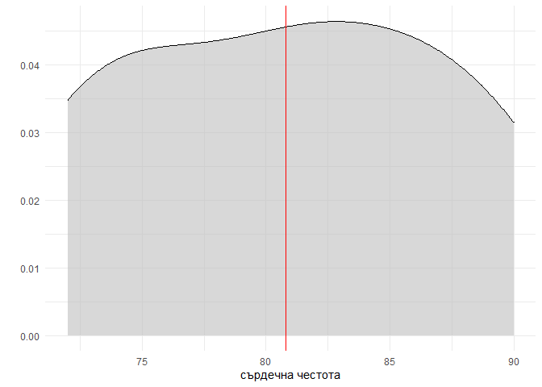
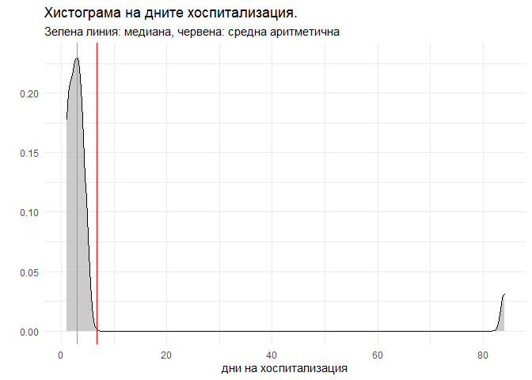
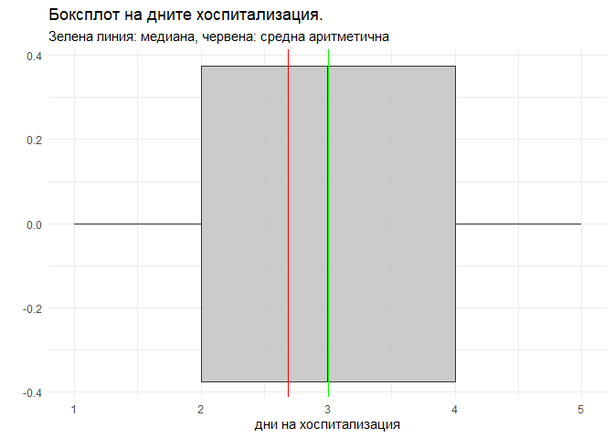
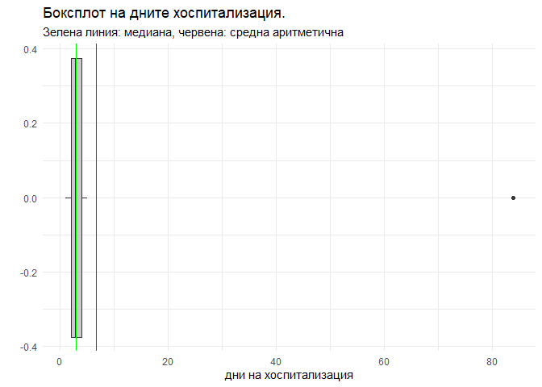

Упражнение 2
================
ас.д-р Костадинов
28. 09. 2021 г.

-   [Вместо увод.](#вместо-увод)
    -   [Основни понятия](#основни-понятия)
    -   [Определения](#определения)
-   [Дескриптивна статистика](#дескриптивна-статистика)
    -   [Видове признаци](#видове-признаци)
    -   [Скали за измерване](#скали-за-измерване)
    -   [Сила на скалите: „Един признак, няколко
        скали"](#сила-на-скалите-един-признак-няколко-скали)
    -   [Показатели за централна
        тенденция](#показатели-за-централна-тенденция)
        -   [Средна аретметична.](#средна-аретметична)
        -   [Други показатели за централна
            тенденция](#други-показатели-за-централна-тенденция)
    -   [Показатели за разсейване.](#показатели-за-разсейване)
        -   [Стандартно отклонение.](#стандартно-отклонение)
        -   [Интерквартилен размах](#интерквартилен-размах)
-   [Инферентна статистика](#инферентна-статистика)
    -   [Стандартна грешка на средната аритметична
        (SEM)](#стандартна-грешка-на-средната-аритметична-sem)
    -   [Интервал на доверителност средна
        аритметична](#интервал-на-доверителност-средна-аритметична)
    -   [Стандартна грешка на процент](#стандартна-грешка-на-процент)
    -   [Интервал на доверителност
        пропорция](#интервал-на-доверителност-пропорция)

# Вместо увод.

Представете си 30 милиона лева накуп. Толкова е бюджета на най-мащабното
статистическо изследване тази година организирано от Националния
статистически институт. Това е преброяването на населението и жилищния
фонд. Организацията на подобно изследване е огромна задача. Изисква над
27 хиляди преброители, поне 2 IT фирми, една дузина статистици и
достатъчно време за да обясним с кого живеем, колко е голяма кухнята и
дали имаме тоалетна в апартамента. Защо обаче са необходими тези данни?
Всъщност причината е известна още от древността. Данните от
преброяването се използват от държавната администрация в процеса на
вземане на решения и разпределяне на финансиране в различни области като
образование, здравеопазване, социална защита и други. Данните от
преброяването са в основата на разработването на национални и регионални
политики, както и при разпределянето на европейски фондове за регионални
проекти и инициативи.

## Основни понятия

Изследване от подобен мащаб, често е невъзможна задача пред учените.
Представете си, че искаме да изследваме сърдечната функция при пациенти
със захарен диабет: за целта няма да е необходимо да изследваме само
български пациенти, ще трябва да изследваме всички диабетици на
планетата - това е практически невъзможно. Причините за това са:
**финансовия ресурс** - ще са необходими много повече от 30 милиона
лева, **човешкия ресурс** - тук няма да имаме нужда от 27 хиляди
“преброители”, а много по-голям екип и то лекари, които да извършат
изследването, а не на последно място **времеви ресурс** - ако за
преброяването е необходимо около година подготовка и месец работа “на
терен”, то за подобно изследване ще са ни необходими години подготовка и
още няколко по толкова за самото изследване.

Как тогава можем да знаем изобщо нещо в медицината? Никой не изследва
всички хора, никой не тества лекарства върху всички пациенти (това освен
невъзможно, е неетично и незаконно). Отговорът разбира се, чрез силата
на статистиката. Статистика ни позволява да изследваме част от хората
представляващи интерес за изследването. Тази част, ще наричаме
`извадка`. В основа на резултатите, които наблюдаваме в извадката, можем
да направим извод за цялата `популация`. Това, обаче е възможно, само
ако хората в тази `извадка` са избрани случайно (иначе казано сме
използвали `рандомизация`). *Справка: лекция 1 на доц.Г.Искров, дм.*

Понякога, можем да не се интересуваме от цялата популация. **Например**,
ако искаме да изследване сърдечната честота на студентите в медицинския
университет, няма особен смисъл да включим в нашата `извадка` кондуктор
в градския транспорт. За да отличим точно групата, за която се
интересуваме използване понятието `генерална съвкупност`.


В някои изследвания, не можем да използваме хора, някои изследвания са
фокусирани върху животни, затова използваме понятието
`единици на наблюдение` за да отличим обектите в нашето проучване.

## Определения

-   Под `дискриптивна` статистика разбираме процесът на анализ на
    явленията вътре в изследваната `извадка`.

-   Под `инферентна статистика` разбираме процеса, при които правим
    извод (обобщение) за `генералната съвкупност`, в основа на
    изследваните показатели в `случайната извадка`.

# Дескриптивна статистика

## Видове признаци

Нека се върнем на **примера** с моето хипотетично изследване. Моята
изследователка хипотеза твърди, че студентите медици са под огромен
стрес по време на упражненията по статистика. Но как мога да измеря
стреса? **Например** със сърдечната честота на всеки студент по време на
упражнения. В случая сърдечната честота е `признак`.
`Статистическият признак` на наблюдение представлява отличителна черта,
белег на една или повече единици - обекти на статистически изследвания.

Можете да мислите за признаците малко по-абстрактно. Всичко около нас (а
и в нас) може да се опише с определени характеристики. **Например** един
студент: можем да опишем неговата височина, тегло, успех от от
положените изпити до момента, пол, сърдечната му честота по време на
упражнение по статистика. Всичко това са `признаци` на наблюдение.

Вероятно от лекцията по статистика, вече знаете, че `признаците` са два
основни типа: `количествени` и `качествени`.

-   `Количествените признаци` са тези характеристики на изследвания
    обект, които могат да бъдат изразени числено. **Например**, ръстът
    на студента може да бъде - 173 см (числено изразяване на признакът
    ръст).

-   `Качествените признаци` са тези характертистики на обекта, които
    нямат самостоятелно числено значение. **Например** полът на
    студента, обект на нашето изследване, може да приема стойностите
    “мъжки” или “женски”. Кръвната група също е пример за качествен
    признак тя няма “числено” значение.

## Скали за измерване

Освен, че `признаците` се разделят на количествени и качествени, те
трябва да бъдат измерени. За измерването на тази признаци се използват
различни `скали`. Тези `скали` определят “типа” на данните, които
събираме. Това е от особено значение за последващият статистически
анализ върху тях!

Такава скала е **например** `номиналната`. Признаци като “диагноза”,
“кръвна група”, “зодиакален знак” и прочие се измерват на такава
`номинална` скала. Тази скала измерва качествени признаци, които имат
отделно значение. **Например** в изследването на студентите, ако
изследваме признакът кръвна група, това ще представлява измерване на
номинална скала.

Някой `признаци` могат да вземат само две стойности: **например** пола-
мъжки или женски, както и наличието на бременност *тук си припомнете
вица за “малко бременна”, жената или е бременна, или не е.* В тези
случаи, измерваме този качествен `признак` (пол, наличие на бременност)
на т.н `дихотомна скала`. Някои статистици, наричат тези признаци с две
възможни стойности алтернативни.

В медицината (а и не само), често използваме термини, като *леко* ,
*умерено* и *тежко състояние,* когато предоставяме информация за някои
пациент. В случая `признакът` на наблюдение е състоянието на пациента.
Този признак е качествен, защото не можем да кажем, че *умерено тежко* е
2 или 3 пъти по-добре от *тежко* състояние. Въпреки това тези стойности,
етикети, с които описване състоянието на пациента имат определена
посока, определена подредба с някакъв логически смисъл. Такива
`признаци на наблюдение` , чиито стойности, могат да се съизмерват
помежду си, но нямат конкретно числово изражение, се измерват на
`ординална скала` .

`количествените` могат да бъдат измервани на `интервална` и
`пропорционална` скала.

При `интервалната` скала “0” -лата няма естествено значение, стойността
“0” не означава липса на признака. **Например** , при измерване на
температурата по скалата на Целзий, нулева е температурата на топене на
леда. Но 0 градуса, не означава липса на температура въобще.
Интервалната скала, съдържа както положителни, така и отрицателни числа
и стойността “0” не означава отсъствие на признакът на наблюдение,
защото тази стойност е възможна и се намира в рамките на логиката на
измерване на този признак.

При пропорционалната скала “0”-лата има значение на “старт”. Това
означава, че стойност “0” е пълно отсъствие на измервания признак.
**Например** ако измерваме сърдечната честота на пациента и отчетем “0”,
това на практика означава, че пациента няма сърдечна честота. Освен
това, отношението на всеки две стойности от скалата, не зависи от
единицата на измерване. Това свойство дава възможност не само да се
сравняват разлики между обектите, но и да се разглеждат отношения между
тях. **Например** измерваме сърдечната честота на студентите преди и по
време на упражнение по статистика. Нека приемем, че честотата на Иван е
60 уд/мин преди упражнение, а по време стига до 90 уд/мин, докато
сърдечната честота на Мария е 80 уд/мин, преди упражнение и достига до
120 уд/мин по време на занятието. В случая сърдечната честота е
`количествен признак` които измерваме на `пропроционална` скала. Това ни
позволява да кажем, че и двамата студенти показват честотата си еднакво
с 50%. Тоест тази скала, ни позволява да изчисляваме пропорции, да
сравняваме не само разликата преди и след, а да сравним и съотношението
им.

<table>
<caption><em>таблица 1. Скали за измерване</em></caption>
<colgroup>
<col style="width: 5%" />
<col style="width: 41%" />
<col style="width: 52%" />
</colgroup>
<thead>
<tr class="header">
<th style="text-align: center;">Скала</th>
<th style="text-align: center;">Характертистики</th>
<th style="text-align: center;">Примери</th>
</tr>
</thead>
<tbody>
<tr class="odd">
<td style="text-align: center;"><p>Номинална</p>
<p>/подтип: дихотомна/</p></td>
<td style="text-align: center;"><p>Категории, “наименования”.</p>
<p>Само две възможни стойности.</p></td>
<td style="text-align: center;"><p>Вид диагноза, кръвна група</p>
<p>Пол</p></td>
</tr>
<tr class="even">
<td style="text-align: center;">Ординална</td>
<td style="text-align: center;">Качествени променливи, които имат логически (нарастващ или намалящ) ред. Не е възможна изчисление на пропорция или разлика</td>
<td style="text-align: center;">Степен на тежест на сърдечна недостатъчност (лека, умерена, тежка), стадии на онкологично заболяване (I-ви, II-ри ..)</td>
</tr>
<tr class="odd">
<td style="text-align: center;">Интервална</td>
<td style="text-align: center;">Качествени променливи. Стойността “0” не означава липса на признака. Допустими са както отрицателни, така и позитивни стойности. Не позволява отношения</td>
<td style="text-align: center;">Температура ( NB: Ако днес е 10 градуса по-топло от вчера, няма как да изчислим “колко процента по-топло е”)</td>
</tr>
<tr class="even">
<td style="text-align: center;">Пропорционална</td>
<td style="text-align: center;">Количествени променливи. Съдържа абсолютната стойност на “0” - липса на признака на наблюдение.</td>
<td style="text-align: center;">Тегло (можем да го измерим с голяма точност 10 кг; 10,5 кг, 10,54 кг и т.н. ; стойността “0” означава липса на тегло). 50 кг е с 10 кг повече от 40 кг., тези 10 кг са с 20% повече от 40 кг.)</td>
</tr>
</tbody>
</table>

*таблица 1. Скали за измерване*

## Сила на скалите: „Един признак, няколко скали"

Нека отново използваме **примера** с теглото. Теглото може да бъде
измерено на `интервална` скала: можем да посочим с доста голяма точност
след десетичната запетая колко тежи един човек. Ако речем сме измерили
теглото на цялата Ви студентка група (10 студента), ще имаме възможност
да извършим редица статистически и математически операции: можем да
изчислим каква е сумата, тоест колко тежи цялата група заедно, или каква
е средната аритметична- колко тежи средно един студент от групата. Тази
скала, може да бъде преобразувана в друга скала. Вместо да измерваме
теглото в килограми, можем да използваме `рангове` така вместо да
записваме килограми, ще запишем най-тежкия студент с ранг “1”,следващият
по тегло ще запишем с ранг “2” и така до най-слабият, който ще вземе
ранг “10”. Такова записване обаче не ни позволява да изчисляваме сумата
на теглото, защото вече нямаме конкретната стойност на количествения
признак. Всъщност сме преобразували една `интервална` скала в
`ординална`. Можем да продължим да преобразуваме скалите, и вместо да
записваме ранг, да запишем само “добре охранен”, " клечъв“,”мускулест" и
т.н, тези етикети са записвани на `номинална скала` , тук вече сме
загубили дори възможността и за “естествена подредба”. Не можем да
намерим нито сумата на теглото, нито средната аритметична, можем само да
кажем, кой “етикет” се среща най-често.

Възможността да се преобразуват скалите определя тяхната `сила`. Както
разгледахме `пропорционалната` скала може да се преобразува в
`ординална`, дори и в `номинална`. Това определя
`пропорционалната скала`, като силна скала. Нека си представим, че сме
записали само тези “етикети” вместо теглото, не съществува начин
по-които да обратно да запишем точно колко килограма съответстват на
даден етикет, за едни “клечъв” може да означава 50 кг, а за друг 70 кг.
Това определя `номиналната скала` като слаба. Тя не позволява такъв обем
математически операции, както интервалната.

## Показатели за централна тенденция

### Средна аретметична.

#### Негрупирани данни

Нека отново разгледаме нашето хипотетично изследване. Припомням, че
изследвахме каква е сърдечната честота на студентите 2-ри курс по време
на упражнение по статистика. Понеже, аз не познавам целия ви курс, за да
мога да направя извод за него, ще използвам само една група. Ще приемем,
че в учебен отдел разпределят студентите по групи по изцяло случаен
принцип. Така, че се с известна условност, ще приемем, че тази
изследвана студентска група е `случайна извадка` на
`генералната съвкупност` - всички студенти в 2-ри курс в специалност
медицина.

    ##  [1] 90 80 89 72 73 74 78 86 84 82

Записали сме стойностите на пулса по време на упражнение. В случая това
са нашите изходни данни. Както прави впечатление, тези стойности са
негрупирани. Имаме само 10 наблюдения изброени едно след друго. В случая
пулсът, ще представим, като непрекъснат признак, измерен на
`пропорционална скала.`. *Внимание! На практика, такива признаци като
сърдечна честота, брой дни, брой пациенти, брой деца, са винаги цели
числа - прекъснати количествени признаци. Въпреки това, често в
статистиката се използват като непрекъснати за да се ползват за
статистически цели (като средната аритметична) например в България
средно една жена ражда 1.7 деца през целия си живот. Практически е дори
смешно да си представим това “0.7” дете, тази стойност е единствено от
статистическо значение при сравнение или при използването и в даден
статистически анализ*

За описателната статистика, особено важно е да създадем `модел`. Както
**например**, за построяването на нова сграда, първоначално се построява
малък макет, които да прилича много на истинската сграда но в умален
мащаб. По същият начин, за да установим пулса на целия курс, трябва да
създадем модел, върху данните от една единствена група, като приемем, че
тя е `случайна извадка`. Как обаче ще създадем модел? В случая модел
означава, една стойност с която да презентираме цялата група. Едно,
единствено число, което да представи “средно” колко е пулса на един
студент от тази група. За целта използваме т.н `средна аритметична`.

-   `Средната аритметична` представлява мярка за централна тенденция.
    Когато работим с негрупирани данни средната аритметична представлява
    сумата от стойностите на една група от числа, разделени на броя на
    групата.


Точно това ни представя и тази сложна формула със странни символи.
Когато изследваме средната стойност за извадката използваме символа *x̄*,
още можете да го срещнете като xbar. В случаят тази средна стройност е
равна на сумата (∑) от всички наши наблюдения върху броя на наблюденията
(*n*)

Това е нещо, което вече знаете от училище, вероятно сте пресмятали
“средния” си успех след последната оценка по химия например.

В случая средният пулс е

    ## [1] 81

Тоест, вече сме създали статистически модел, Ако не знаем точната
стойност на пулса на някой студент в групата и някой ни накара да
“предположим” някаква стойност, можем да използваме средната аритметична
и няма да сме сгрешили много.

Можем да представим и графично тези данни. На една фигура, можем да
представим разпределението на наблюдаваните стойности - по хоризонтала,
ще сложим всички наблюдавани стойности, а по вертикала, колко често сме
ги наблюдавали. В резултат, че получим графика, която се нарича
емпирично разпределение, тоест това разпределение, което сме наблюдавали
след като сме събрали данните.

<!-- -->

На фигурата виждате цялото разпределение на измерените стойности на
пулса. С черната вертикална линия е представена средната аритметична.

#### Групирани данни

###### Интервален ред

Понеже съм критикуван за малкия брой единици на наблюдение (едва 10
студенти), няколко колеги желаят да ми помогнат за моето изследване.
Сега вместо 10 студенти от всички 200, имаме данните на 45 случайно
избрани студенти от 2-ри курс. Нека разгледаме данните, в `таблица 2`

|  пулс   | брой студенти |
|:-------:|:-------------:|
| 48 - 52 |       4       |
| 53 - 57 |       5       |
| 58 - 62 |       8       |
| 63 - 67 |      11       |
| 68 - 72 |       6       |
| 73 - 77 |       6       |
| 78 - 82 |       5       |

Таблица 2: Получени данни за пулса, сред 45- студента.

Както се вижда, тук данните вече са `групирани` това на практика
означава, че студентите са разпределени в групи спрямо `интервала` на
сърдечната честота. В първата група са студените с сърдечна честота от
48 до 52 уд/мин. Стойности в този диапазон са наблюдавани сред 4-ма
студента. В следващият интервал са 5-ма студенти с честотата в диапазона
между 53 и 57 уд/мин. Тук е важно да се подчертае някой основни елементи
на статистическото групиране. Това групиране на данните се нарича още
групиране в `интервален ред.`

-   Интервалите имат еднаква ширина. Това е изпълнено в случая:
    интервалите са през 4 удъра.
-   Интервалите не се застъпват. Това също е изпълнено, първият интервал
    започва от 48 уд/мин до 52 уд/мин, вторият интервал започва с 53
    уд/мин. Това означава, че ако имаме студент с 52 уд/мин, ще го
    преброим само в първият интервал.
-   Не знаем точния пулс на участниците. Това е един от недостатъците на
    групирането в интервални редове: след като погледнем таблицата можем
    със сигурност да кажем, че имаме 11 участника с пулс между 63 и 67
    уд/мин. Въпреки това, ние не знаем точната стойност на пулса- всички
    те могат да имат пулс 63 или 10 от 11 да имат пулс 67. Това **намаля
    точността**, с която може да определим средната аритметична.
-   Интервалният ред е подходящ при огромен обем данни, позволява
    по-бързо пресмятане на интересуващите ни показатели.

Но как изчисляваме средната аритметична в този случай?

Отново разполагаме с формула, този път тя изглежда:


Нека обясним всеки символ в нея и какво трябва да направим. За да
изчислим средната аритметична *x̄* трябва да умножим *x*<sub>*u*</sub> по
*f* . Но какво е *x*<sub>*u*</sub>? Това е средата на интервала. В
нашият пример първият интервал съдържа стойностите от 48 до 52. Неговата
среда ще открием, като съберем 48 и 52 и ги разделим на 2 : получаваме
50- това е средата на първия интервал:

``` r
interval_mean_1 = (48 + 52)/2
interval_mean_1
```

    ## [1] 50

Трябва да извършим този процес за всички интервали, така получаваме
следната таблица (`таблциа 3`)

|  пулс   | среда на интервала | брой студенти |
|:-------:|:------------------:|:-------------:|
| 48 - 52 |         50         |       4       |
| 53 - 57 |         55         |       5       |
| 58 - 62 |         60         |       8       |
| 63 - 67 |         65         |      11       |
| 68 - 72 |         70         |       6       |
| 73 - 77 |         75         |       6       |
| 78 - 82 |         80         |       5       |

Таблица 3: Интервал на пулса, среда на интервала и честота

След като вече знаем какво е *x*<sub>*u*</sub>, следва да разберем какво
е *f*, това всъщност е наблюдаваната честота. Иначе казано сред колко
студента сме наблюдавали в този интервал. Това вече го имаме в
последната колона на `таблциа 3`). След това формулата изисква от нас са
умножим *x*<sub>*u*</sub> по *f*. За първият ни интервал това означава
да умножим средата 50 по броя на студентите в него : 4. Получаваме 200

``` r
хu_f = interval_mean_1 * 4
хu_f
```

    ## [1] 200

Това умножение, ще направим за всички интервали и ще добавим нова колона
с произведението:

|  Пулс   | Среда на интервала | Брои студенти | Произведение *x*<sub>*u*</sub> по *f*. |
|:-------:|:------------------:|:-------------:|:--------------------------------------:|
| 48 - 52 |         50         |       4       |                  200                   |
| 53 - 57 |         55         |       5       |                  275                   |
| 58 - 62 |         60         |       8       |                  480                   |
| 63 - 67 |         65         |      11       |                  715                   |
| 68 - 72 |         70         |       6       |                  420                   |
| 73 - 77 |         75         |       6       |                  450                   |
| 78 - 82 |         80         |       5       |                  400                   |

Таблица 4. Интервал на пулса, среда на интервала, честота и произведение

След като сме направили и тази стъпка, следва да намерим сумата от
всички произведения. Това е смисъл на тази странна буква сигма ∑. За да
го направим просто трябва да съберем всички числа намиращи се в третата
колона. В резултат получаваме 2940. Това е стойността, която трябва да
поставим в числителя

``` r
sum_xu_f = 200 + 275 + 480 + 715 + 420 + 450 + 400
sum_xu_f
```

    ## [1] 2940

За знаменател, отново поглеждаме формулата по-горе. Виждаме изписано:
∑<sub>*f*</sub>, което в превод от гръцки означа, че ни е необходимо
сумата от наблюдаваните честоти. Вече е ясно, че честотата е броя на
студентите в дадения интервал. Тоест за знаменател трябва да съберем
всички студенти.

``` r
sum_f = 4 + 5 +8 + 11 + 6 + 6 + 5 
sum_f
```

    ## [1] 45

Тоест за знаменател ще използваме числото 45.

След тези “сложни” пресмятания следва да заместим във формулата
<a href="https://www.codecogs.com/eqnedit.php?latex=\bar{x}&space;=&space;\frac{\sum&space;x_{u}f}{\sum_f&space;}&space;=&space;\frac&space;{2940}&space;{45}&space;=&space;65.33" target="_blank"></a>
В крайна сметка получаваме резултата 65.33- това е средната стойност за
извадката.

###### Степенен ред

Понякога можем да получим отново групирани данни, но не в интервален
ред, а в степенен такъв. Да си представим **например**, че сме
продължили нашето изследване за пулса, този път сме отчели всяка една
стойност на пулса, а срещу нея нанасяне броя на студентите, които сме
отчели с нея. Получаваме информацията, както е показано на `таблица  5`.

| Стойност на пулса | Брой студенти |
|:-----------------:|:-------------:|
|        59         |       1       |
|        60         |       0       |
|        61         |       2       |
|        62         |       4       |
|        63         |       0       |
|        64         |       3       |
|        65         |       2       |
|        66         |       1       |
|        67         |       1       |
|        68         |       3       |

Таблица 5. Степенен ред

Отново имаме формула, която да ни подскаже, как да изчислим средната
аритметична, при такъв тип групиране на данните.
<a href="https://www.codecogs.com/eqnedit.php?latex=\bar{x}=\frac{\sum&space;x_{}f}{\sum_f}" target="_blank"></a>
В случаят, трябва да умножим всяка наблюдавана стойност на пулса по
честотата с която сме я наблюдавали. Обърнете внимание, че в таблицата
сърдечна честота 63уд/мин не е наблюдавана при нито един студент. Тоест
такава, честота всъщност не е наблюдавана въобще. Отново е необходимо
първо да извършим умножението, а после да извършим сумирането на всички
произведения. Накрая ще разделим полученото число на сумата на всички
наблюдавани лица.

### Други показатели за централна тенденция

Освен средната аритметична съществуват и други показатели, като
представят централната (основаната) тенденция в данните ни. Например:

-   `Медиана`: Това представлява стойността, която се намира в средата
    на статистическия ред, т.е. тя е онази стойност, за която половината
    от измерванията са по-малки от нея, а другата половина са по-големи
    от нея. **Например** ако сме измерили кръвната захар на един наш
    пациент 3 пъти на ден за 3 дни можем да получим следните стойности :
    `6.0`, `6.5`, `7.0`, `7.5`, `8.00` В случаят стойността 7.0 е
    медиана- тя разделя този ред на две симетрични части. Понякога може
    да имаме и по- различен ред, **например** `1`, `2`, `3`, `4`, `5`,
    `6`, `7`, `8`. В този пример, няма стойност която да раздели реда на
    две равни части. В **примера** имаме четен брой стойности: затова
    взимаме тези две в средата му: `4` и `5`, а медианата ще получим,
    като ги съберем и разделим на две: тоест медианата в случая ще бъде
    4.5.

-   `Мода`. Модата *M*<sub>0</sub> е най-елементарният показател на
    централната тенденция. Тя се определя като стойността с най-голяма
    честота в разпределението и се намира непосредствено чрез броене.
    **Например**, ако имаме следните данни за систолното кръвно налягане
    `120`, `120`,`130`, `135`,`120`,`140`,`140`. Най-честата стойност е
    `120` - това е модата в този статистически ред. Възможно е да имаме
    и две моди- две стойности, които се срещат еднакво често, тогава
    наричаме разпределението `бимодално`.

-   Когато променливите са `номинални` или `ординални` скали, като
    показател можем да използваме добре известния процент. Например, ако
    искаме да разберем какъв е относителния дял на момичетата в групата,
    ще трябва да разделим броя на момичета, върху броя на студентите в
    цялата група и да умножим по 100. Формулата има вида
 <a href="https://www.codecogs.com/eqnedit.php?latex=\hat{p}=\frac{m}{n}{100}" target="_blank"></a>
    където *m* е броя на единиците, които
    притежават дадената характеристика (момичета), а *n* e броя на
    единиците в съвкупността (всички студенти в групата).

## Показатели за разсейване.

### Стандартно отклонение.

Нека отново дадем **пример**. Във вашата практика имате двама пациенти
със захарен диабет. Двамата идват при вас със записани стойности на
кръвната захар. Прилежно Иван и Димитър са проследявали кръвната захар
три пъти дневно в продължение на една цяла седмица. Как да определим
дали да променим терапията например? След толкова задачи за средна
аритметична, вероятно бихте отговорили, че е достатъчно да разберем
средната аритметична.

Нека проверим, колко е средната кръвна захар и при двамата пациенти: за
всеки от тях събираме всички наблюдения (всички стойности на кръвната
захар и ги разделяме на броя на наблюденията). В резултат получаваме
средна стойност за Димитър 9.10, а за Иван 11.76. Двамата пациенти са не
особено задоволителен контрол на кръвната захар. Но към кого да подходим
агресивно, кой от тях трябва да бъде лекуван с по-силни лекарства
поддържащи кръвната захар в по-добри стойности като цяло?

</style>
<table class="gt_table">
  
  <thead class="gt_col_headings">
    <tr>
      <th class="gt_col_heading gt_columns_bottom_border gt_center" rowspan="1" colspan="1">patient</th>
      <th class="gt_col_heading gt_columns_bottom_border gt_right" rowspan="1" colspan="1">mean_gluc</th>
    </tr>
  </thead>
  <tbody class="gt_table_body">
    <tr><td class="gt_row gt_center">Dimitar</td>
<td class="gt_row gt_right">9.10</td></tr>
    <tr><td class="gt_row gt_center">Ivan </td>
<td class="gt_row gt_right">11.76</td></tr>
  </tbody>
  
  
</table>
</div>

Не можем да отговорим на този въпрос, единствено в основата само на
средната аритметична стойност на кръвната захар. Необходими са ни повече
данни. **Например** колко варира тази стойност през денонощието. Може да
се окаже, че един от пациентите поддържа почти еднакви стойности през
целия ден и през цялата седмица- тоест има относително задоволителен
контрол, докато другият пациент има много високи и ниски стойности-
тоест контролът на кръвната захар е лабилен. За да разберем това е
необходимо да изчислим показатели, които оценяват разсейването,
вариацията на стойностите спрямо тази средна.

По-нагоре, споменахме, че средната аритметична е всъщност един модел.
Тоест, ако сме принудени да предположим, каква ще е кръвната захар на
Иван независимо от времето на измерване и деня, то ако предположим
средната, няма да сгрешим особено много. Точно това се опитваме да
оценим с показатели за разсейване - колко е добър този модел, доколко
показателите за централна тенденция успяват да презентират добре
данните, доколко може да и им се вярва.

-   `Размах`. Това е първата величина, която можем да използваме за да
    разберем дали имаме голяма вариабилност на данните. `Размахът` е
    равен на разликата между минималната и максималната отчете стойност.
    Нека разгледаме таблицата с данните за Иван и Димитър отново и да
    определим какъв е размаха.

<div id="nkofewclub" style="overflow-x:auto;overflow-y:auto;width:auto;height:auto;">
<style>html {
  font-family: -apple-system, BlinkMacSystemFont, 'Segoe UI', Roboto, Oxygen, Ubuntu, Cantarell, 'Helvetica Neue', 'Fira Sans', 'Droid Sans', Arial, sans-serif;
}

#nkofewclub .gt_table {
  display: table;
  border-collapse: collapse;
  margin-left: auto;
  margin-right: auto;
  color: #333333;
  font-size: 16px;
  font-weight: normal;
  font-style: normal;
  background-color: #FFFFFF;
  width: auto;
  border-top-style: solid;
  border-top-width: 2px;
  border-top-color: #A8A8A8;
  border-right-style: none;
  border-right-width: 2px;
  border-right-color: #D3D3D3;
  border-bottom-style: solid;
  border-bottom-width: 2px;
  border-bottom-color: #A8A8A8;
  border-left-style: none;
  border-left-width: 2px;
  border-left-color: #D3D3D3;
}

#nkofewclub .gt_heading {
  background-color: #FFFFFF;
  text-align: center;
  border-bottom-color: #FFFFFF;
  border-left-style: none;
  border-left-width: 1px;
  border-left-color: #D3D3D3;
  border-right-style: none;
  border-right-width: 1px;
  border-right-color: #D3D3D3;
}

#nkofewclub .gt_title {
  color: #333333;
  font-size: 125%;
  font-weight: initial;
  padding-top: 4px;
  padding-bottom: 4px;
  border-bottom-color: #FFFFFF;
  border-bottom-width: 0;
}

#nkofewclub .gt_subtitle {
  color: #333333;
  font-size: 85%;
  font-weight: initial;
  padding-top: 0;
  padding-bottom: 6px;
  border-top-color: #FFFFFF;
  border-top-width: 0;
}

#nkofewclub .gt_bottom_border {
  border-bottom-style: solid;
  border-bottom-width: 2px;
  border-bottom-color: #D3D3D3;
}

#nkofewclub .gt_col_headings {
  border-top-style: solid;
  border-top-width: 2px;
  border-top-color: #D3D3D3;
  border-bottom-style: solid;
  border-bottom-width: 2px;
  border-bottom-color: #D3D3D3;
  border-left-style: none;
  border-left-width: 1px;
  border-left-color: #D3D3D3;
  border-right-style: none;
  border-right-width: 1px;
  border-right-color: #D3D3D3;
}

#nkofewclub .gt_col_heading {
  color: #333333;
  background-color: #FFFFFF;
  font-size: 100%;
  font-weight: normal;
  text-transform: inherit;
  border-left-style: none;
  border-left-width: 1px;
  border-left-color: #D3D3D3;
  border-right-style: none;
  border-right-width: 1px;
  border-right-color: #D3D3D3;
  vertical-align: bottom;
  padding-top: 5px;
  padding-bottom: 6px;
  padding-left: 5px;
  padding-right: 5px;
  overflow-x: hidden;
}

#nkofewclub .gt_column_spanner_outer {
  color: #333333;
  background-color: #FFFFFF;
  font-size: 100%;
  font-weight: normal;
  text-transform: inherit;
  padding-top: 0;
  padding-bottom: 0;
  padding-left: 4px;
  padding-right: 4px;
}

#nkofewclub .gt_column_spanner_outer:first-child {
  padding-left: 0;
}

#nkofewclub .gt_column_spanner_outer:last-child {
  padding-right: 0;
}

#nkofewclub .gt_column_spanner {
  border-bottom-style: solid;
  border-bottom-width: 2px;
  border-bottom-color: #D3D3D3;
  vertical-align: bottom;
  padding-top: 5px;
  padding-bottom: 5px;
  overflow-x: hidden;
  display: inline-block;
  width: 100%;
}

#nkofewclub .gt_group_heading {
  padding: 8px;
  color: #333333;
  background-color: #FFFFFF;
  font-size: 100%;
  font-weight: initial;
  text-transform: inherit;
  border-top-style: solid;
  border-top-width: 2px;
  border-top-color: #D3D3D3;
  border-bottom-style: solid;
  border-bottom-width: 2px;
  border-bottom-color: #D3D3D3;
  border-left-style: none;
  border-left-width: 1px;
  border-left-color: #D3D3D3;
  border-right-style: none;
  border-right-width: 1px;
  border-right-color: #D3D3D3;
  vertical-align: middle;
}

#nkofewclub .gt_empty_group_heading {
  padding: 0.5px;
  color: #333333;
  background-color: #FFFFFF;
  font-size: 100%;
  font-weight: initial;
  border-top-style: solid;
  border-top-width: 2px;
  border-top-color: #D3D3D3;
  border-bottom-style: solid;
  border-bottom-width: 2px;
  border-bottom-color: #D3D3D3;
  vertical-align: middle;
}

#nkofewclub .gt_from_md > :first-child {
  margin-top: 0;
}

#nkofewclub .gt_from_md > :last-child {
  margin-bottom: 0;
}

#nkofewclub .gt_row {
  padding-top: 8px;
  padding-bottom: 8px;
  padding-left: 5px;
  padding-right: 5px;
  margin: 10px;
  border-top-style: solid;
  border-top-width: 1px;
  border-top-color: #D3D3D3;
  border-left-style: none;
  border-left-width: 1px;
  border-left-color: #D3D3D3;
  border-right-style: none;
  border-right-width: 1px;
  border-right-color: #D3D3D3;
  vertical-align: middle;
  overflow-x: hidden;
}

#nkofewclub .gt_stub {
  color: #333333;
  background-color: #FFFFFF;
  font-size: 100%;
  font-weight: initial;
  text-transform: inherit;
  border-right-style: solid;
  border-right-width: 2px;
  border-right-color: #D3D3D3;
  padding-left: 12px;
}

#nkofewclub .gt_summary_row {
  color: #333333;
  background-color: #FFFFFF;
  text-transform: inherit;
  padding-top: 8px;
  padding-bottom: 8px;
  padding-left: 5px;
  padding-right: 5px;
}

#nkofewclub .gt_first_summary_row {
  padding-top: 8px;
  padding-bottom: 8px;
  padding-left: 5px;
  padding-right: 5px;
  border-top-style: solid;
  border-top-width: 2px;
  border-top-color: #D3D3D3;
}

#nkofewclub .gt_grand_summary_row {
  color: #333333;
  background-color: #FFFFFF;
  text-transform: inherit;
  padding-top: 8px;
  padding-bottom: 8px;
  padding-left: 5px;
  padding-right: 5px;
}

#nkofewclub .gt_first_grand_summary_row {
  padding-top: 8px;
  padding-bottom: 8px;
  padding-left: 5px;
  padding-right: 5px;
  border-top-style: double;
  border-top-width: 6px;
  border-top-color: #D3D3D3;
}

#nkofewclub .gt_striped {
  background-color: rgba(128, 128, 128, 0.05);
}

#nkofewclub .gt_table_body {
  border-top-style: solid;
  border-top-width: 2px;
  border-top-color: #D3D3D3;
  border-bottom-style: solid;
  border-bottom-width: 2px;
  border-bottom-color: #D3D3D3;
}

#nkofewclub .gt_footnotes {
  color: #333333;
  background-color: #FFFFFF;
  border-bottom-style: none;
  border-bottom-width: 2px;
  border-bottom-color: #D3D3D3;
  border-left-style: none;
  border-left-width: 2px;
  border-left-color: #D3D3D3;
  border-right-style: none;
  border-right-width: 2px;
  border-right-color: #D3D3D3;
}

#nkofewclub .gt_footnote {
  margin: 0px;
  font-size: 90%;
  padding: 4px;
}

#nkofewclub .gt_sourcenotes {
  color: #333333;
  background-color: #FFFFFF;
  border-bottom-style: none;
  border-bottom-width: 2px;
  border-bottom-color: #D3D3D3;
  border-left-style: none;
  border-left-width: 2px;
  border-left-color: #D3D3D3;
  border-right-style: none;
  border-right-width: 2px;
  border-right-color: #D3D3D3;
}

#nkofewclub .gt_sourcenote {
  font-size: 90%;
  padding: 4px;
}

#nkofewclub .gt_left {
  text-align: left;
}

#nkofewclub .gt_center {
  text-align: center;
}

#nkofewclub .gt_right {
  text-align: right;
  font-variant-numeric: tabular-nums;
}

#nkofewclub .gt_font_normal {
  font-weight: normal;
}

#nkofewclub .gt_font_bold {
  font-weight: bold;
}

#nkofewclub .gt_font_italic {
  font-style: italic;
}

#nkofewclub .gt_super {
  font-size: 65%;
}

#nkofewclub .gt_footnote_marks {
  font-style: italic;
  font-weight: normal;
  font-size: 65%;
}
</style>
<table class="gt_table">
  
  <thead class="gt_col_headings">
    <tr>
      <th class="gt_col_heading gt_columns_bottom_border gt_center" rowspan="1" colspan="1">patient</th>
      <th class="gt_col_heading gt_columns_bottom_border gt_right" rowspan="1" colspan="1">range</th>
    </tr>
  </thead>
  <tbody class="gt_table_body">
    <tr><td class="gt_row gt_center">Dimitar</td>
<td class="gt_row gt_right">5</td></tr>
    <tr><td class="gt_row gt_center">Ivan </td>
<td class="gt_row gt_right">15</td></tr>
  </tbody>
  
  
</table>
</div>

Както се вижда от резултатите, Иван има много по-висок размах на
стойностите на кръвната захар. Но това може да се дължи на грешка на
апарата за измерване- **например** да не е сложил достатъчно количество
кръв на тест лентичката. Този резултат може да е лъжливо нисък и от тук
и нашите калкулации използвайки размаха, като оценител на
вариабилността. В случая, ако имаме дори една екстремно ниска или
екстремно висока стойност, то и резултатът ще е голям. Дори ако всички
други измервания на кръвната захар са били 9 **например**, само тази
една екстремно ниска или висока стойност ще доведе до голям размах. Това
е основната причина размахът да не се използва толкова често.

Нека отново се върнем на примера със студентите и сърдечната им честота
по време на упражнение по статистика. В първият пример, когато бяхме
измерили сърдечната честота, само на една единствена група получихме
следните **негрупирани** данни.

    ## $value
    ##  [1] 90 80 89 72 73 74 78 86 84 82

Лесно можем да изчислим и средната аритметична на тази извадка -
събираме всички стойности и ги делим на броя на наблюденията. В случая
средната е
<a href="https://www.codecogs.com/eqnedit.php?latex=\bar{x}&space;=&space;\frac&space;{90&plus;80&plus;89&plus;72&plus;73&plus;74&plus;78&plus;86&plus;84&plus;82}{10}&space;=&space;80.8" target="_blank"></a> За да
разберем каква е вариабилността, можем да изчислим каква е разликата
между пулса на всеки участник от тази средна за цялата група. Така ще
получим `девиацията`. По този начин, можем да видим колко се отклонява
измереният пулс на всеки от студентите спрямо средния пулс на групата.
Така в нашият пример, студентът с пулс 90 се отклонява с 9.2 от средната
стойност на групата. Студентът с пулс 72 се отклонява с - 8.8 от
средната стойност за групата.

<div id="yfagluywrw" style="overflow-x:auto;overflow-y:auto;width:auto;height:auto;">
<style>html {
  font-family: -apple-system, BlinkMacSystemFont, 'Segoe UI', Roboto, Oxygen, Ubuntu, Cantarell, 'Helvetica Neue', 'Fira Sans', 'Droid Sans', Arial, sans-serif;
}

#yfagluywrw .gt_table {
  display: table;
  border-collapse: collapse;
  margin-left: auto;
  margin-right: auto;
  color: #333333;
  font-size: 16px;
  font-weight: normal;
  font-style: normal;
  background-color: #FFFFFF;
  width: auto;
  border-top-style: solid;
  border-top-width: 2px;
  border-top-color: #A8A8A8;
  border-right-style: none;
  border-right-width: 2px;
  border-right-color: #D3D3D3;
  border-bottom-style: solid;
  border-bottom-width: 2px;
  border-bottom-color: #A8A8A8;
  border-left-style: none;
  border-left-width: 2px;
  border-left-color: #D3D3D3;
}

#yfagluywrw .gt_heading {
  background-color: #FFFFFF;
  text-align: center;
  border-bottom-color: #FFFFFF;
  border-left-style: none;
  border-left-width: 1px;
  border-left-color: #D3D3D3;
  border-right-style: none;
  border-right-width: 1px;
  border-right-color: #D3D3D3;
}

#yfagluywrw .gt_title {
  color: #333333;
  font-size: 125%;
  font-weight: initial;
  padding-top: 4px;
  padding-bottom: 4px;
  border-bottom-color: #FFFFFF;
  border-bottom-width: 0;
}

#yfagluywrw .gt_subtitle {
  color: #333333;
  font-size: 85%;
  font-weight: initial;
  padding-top: 0;
  padding-bottom: 6px;
  border-top-color: #FFFFFF;
  border-top-width: 0;
}

#yfagluywrw .gt_bottom_border {
  border-bottom-style: solid;
  border-bottom-width: 2px;
  border-bottom-color: #D3D3D3;
}

#yfagluywrw .gt_col_headings {
  border-top-style: solid;
  border-top-width: 2px;
  border-top-color: #D3D3D3;
  border-bottom-style: solid;
  border-bottom-width: 2px;
  border-bottom-color: #D3D3D3;
  border-left-style: none;
  border-left-width: 1px;
  border-left-color: #D3D3D3;
  border-right-style: none;
  border-right-width: 1px;
  border-right-color: #D3D3D3;
}

#yfagluywrw .gt_col_heading {
  color: #333333;
  background-color: #FFFFFF;
  font-size: 100%;
  font-weight: normal;
  text-transform: inherit;
  border-left-style: none;
  border-left-width: 1px;
  border-left-color: #D3D3D3;
  border-right-style: none;
  border-right-width: 1px;
  border-right-color: #D3D3D3;
  vertical-align: bottom;
  padding-top: 5px;
  padding-bottom: 6px;
  padding-left: 5px;
  padding-right: 5px;
  overflow-x: hidden;
}

#yfagluywrw .gt_column_spanner_outer {
  color: #333333;
  background-color: #FFFFFF;
  font-size: 100%;
  font-weight: normal;
  text-transform: inherit;
  padding-top: 0;
  padding-bottom: 0;
  padding-left: 4px;
  padding-right: 4px;
}

#yfagluywrw .gt_column_spanner_outer:first-child {
  padding-left: 0;
}

#yfagluywrw .gt_column_spanner_outer:last-child {
  padding-right: 0;
}

#yfagluywrw .gt_column_spanner {
  border-bottom-style: solid;
  border-bottom-width: 2px;
  border-bottom-color: #D3D3D3;
  vertical-align: bottom;
  padding-top: 5px;
  padding-bottom: 5px;
  overflow-x: hidden;
  display: inline-block;
  width: 100%;
}

#yfagluywrw .gt_group_heading {
  padding: 8px;
  color: #333333;
  background-color: #FFFFFF;
  font-size: 100%;
  font-weight: initial;
  text-transform: inherit;
  border-top-style: solid;
  border-top-width: 2px;
  border-top-color: #D3D3D3;
  border-bottom-style: solid;
  border-bottom-width: 2px;
  border-bottom-color: #D3D3D3;
  border-left-style: none;
  border-left-width: 1px;
  border-left-color: #D3D3D3;
  border-right-style: none;
  border-right-width: 1px;
  border-right-color: #D3D3D3;
  vertical-align: middle;
}

#yfagluywrw .gt_empty_group_heading {
  padding: 0.5px;
  color: #333333;
  background-color: #FFFFFF;
  font-size: 100%;
  font-weight: initial;
  border-top-style: solid;
  border-top-width: 2px;
  border-top-color: #D3D3D3;
  border-bottom-style: solid;
  border-bottom-width: 2px;
  border-bottom-color: #D3D3D3;
  vertical-align: middle;
}

#yfagluywrw .gt_from_md > :first-child {
  margin-top: 0;
}

#yfagluywrw .gt_from_md > :last-child {
  margin-bottom: 0;
}

#yfagluywrw .gt_row {
  padding-top: 8px;
  padding-bottom: 8px;
  padding-left: 5px;
  padding-right: 5px;
  margin: 10px;
  border-top-style: solid;
  border-top-width: 1px;
  border-top-color: #D3D3D3;
  border-left-style: none;
  border-left-width: 1px;
  border-left-color: #D3D3D3;
  border-right-style: none;
  border-right-width: 1px;
  border-right-color: #D3D3D3;
  vertical-align: middle;
  overflow-x: hidden;
}

#yfagluywrw .gt_stub {
  color: #333333;
  background-color: #FFFFFF;
  font-size: 100%;
  font-weight: initial;
  text-transform: inherit;
  border-right-style: solid;
  border-right-width: 2px;
  border-right-color: #D3D3D3;
  padding-left: 12px;
}

#yfagluywrw .gt_summary_row {
  color: #333333;
  background-color: #FFFFFF;
  text-transform: inherit;
  padding-top: 8px;
  padding-bottom: 8px;
  padding-left: 5px;
  padding-right: 5px;
}

#yfagluywrw .gt_first_summary_row {
  padding-top: 8px;
  padding-bottom: 8px;
  padding-left: 5px;
  padding-right: 5px;
  border-top-style: solid;
  border-top-width: 2px;
  border-top-color: #D3D3D3;
}

#yfagluywrw .gt_grand_summary_row {
  color: #333333;
  background-color: #FFFFFF;
  text-transform: inherit;
  padding-top: 8px;
  padding-bottom: 8px;
  padding-left: 5px;
  padding-right: 5px;
}

#yfagluywrw .gt_first_grand_summary_row {
  padding-top: 8px;
  padding-bottom: 8px;
  padding-left: 5px;
  padding-right: 5px;
  border-top-style: double;
  border-top-width: 6px;
  border-top-color: #D3D3D3;
}

#yfagluywrw .gt_striped {
  background-color: rgba(128, 128, 128, 0.05);
}

#yfagluywrw .gt_table_body {
  border-top-style: solid;
  border-top-width: 2px;
  border-top-color: #D3D3D3;
  border-bottom-style: solid;
  border-bottom-width: 2px;
  border-bottom-color: #D3D3D3;
}

#yfagluywrw .gt_footnotes {
  color: #333333;
  background-color: #FFFFFF;
  border-bottom-style: none;
  border-bottom-width: 2px;
  border-bottom-color: #D3D3D3;
  border-left-style: none;
  border-left-width: 2px;
  border-left-color: #D3D3D3;
  border-right-style: none;
  border-right-width: 2px;
  border-right-color: #D3D3D3;
}

#yfagluywrw .gt_footnote {
  margin: 0px;
  font-size: 90%;
  padding: 4px;
}

#yfagluywrw .gt_sourcenotes {
  color: #333333;
  background-color: #FFFFFF;
  border-bottom-style: none;
  border-bottom-width: 2px;
  border-bottom-color: #D3D3D3;
  border-left-style: none;
  border-left-width: 2px;
  border-left-color: #D3D3D3;
  border-right-style: none;
  border-right-width: 2px;
  border-right-color: #D3D3D3;
}

#yfagluywrw .gt_sourcenote {
  font-size: 90%;
  padding: 4px;
}

#yfagluywrw .gt_left {
  text-align: left;
}

#yfagluywrw .gt_center {
  text-align: center;
}

#yfagluywrw .gt_right {
  text-align: right;
  font-variant-numeric: tabular-nums;
}

#yfagluywrw .gt_font_normal {
  font-weight: normal;
}

#yfagluywrw .gt_font_bold {
  font-weight: bold;
}

#yfagluywrw .gt_font_italic {
  font-style: italic;
}

#yfagluywrw .gt_super {
  font-size: 65%;
}

#yfagluywrw .gt_footnote_marks {
  font-style: italic;
  font-weight: normal;
  font-size: 65%;
}
</style>
<table class="gt_table">
  
  <thead class="gt_col_headings">
    <tr>
      <th class="gt_col_heading gt_columns_bottom_border gt_right" rowspan="1" colspan="1">pulse</th>
      <th class="gt_col_heading gt_columns_bottom_border gt_right" rowspan="1" colspan="1">deviation</th>
    </tr>
  </thead>
  <tbody class="gt_table_body">
    <tr><td class="gt_row gt_right">90</td>
<td class="gt_row gt_right">9.2</td></tr>
    <tr><td class="gt_row gt_right">80</td>
<td class="gt_row gt_right">-0.8</td></tr>
    <tr><td class="gt_row gt_right">89</td>
<td class="gt_row gt_right">8.2</td></tr>
    <tr><td class="gt_row gt_right">72</td>
<td class="gt_row gt_right">-8.8</td></tr>
    <tr><td class="gt_row gt_right">73</td>
<td class="gt_row gt_right">-7.8</td></tr>
    <tr><td class="gt_row gt_right">74</td>
<td class="gt_row gt_right">-6.8</td></tr>
    <tr><td class="gt_row gt_right">78</td>
<td class="gt_row gt_right">-2.8</td></tr>
    <tr><td class="gt_row gt_right">86</td>
<td class="gt_row gt_right">5.2</td></tr>
    <tr><td class="gt_row gt_right">84</td>
<td class="gt_row gt_right">3.2</td></tr>
    <tr><td class="gt_row gt_right">82</td>
<td class="gt_row gt_right">1.2</td></tr>
  </tbody>
  
  
</table>
</div>

Вече знаем, колко е индивидуалното отклонение на всеки един от
студентите. Необходимо е обаче да измерим, колко “отклонение” има в
цялата група. Дали като цяло групата се представя добре с една
единствена стойност - тази на средната аритметична или не. Ако съберем
девиациите на всички участници, че получим “0”. Това не определено няма
да ни помогне. Затова можем да повдигнем девиацията на квадрат. По този
начин ще премахнем отрицателния знак.

<div id="dqamdsxbao" style="overflow-x:auto;overflow-y:auto;width:auto;height:auto;">
<style>html {
  font-family: -apple-system, BlinkMacSystemFont, 'Segoe UI', Roboto, Oxygen, Ubuntu, Cantarell, 'Helvetica Neue', 'Fira Sans', 'Droid Sans', Arial, sans-serif;
}

#dqamdsxbao .gt_table {
  display: table;
  border-collapse: collapse;
  margin-left: auto;
  margin-right: auto;
  color: #333333;
  font-size: 16px;
  font-weight: normal;
  font-style: normal;
  background-color: #FFFFFF;
  width: auto;
  border-top-style: solid;
  border-top-width: 2px;
  border-top-color: #A8A8A8;
  border-right-style: none;
  border-right-width: 2px;
  border-right-color: #D3D3D3;
  border-bottom-style: solid;
  border-bottom-width: 2px;
  border-bottom-color: #A8A8A8;
  border-left-style: none;
  border-left-width: 2px;
  border-left-color: #D3D3D3;
}

#dqamdsxbao .gt_heading {
  background-color: #FFFFFF;
  text-align: center;
  border-bottom-color: #FFFFFF;
  border-left-style: none;
  border-left-width: 1px;
  border-left-color: #D3D3D3;
  border-right-style: none;
  border-right-width: 1px;
  border-right-color: #D3D3D3;
}

#dqamdsxbao .gt_title {
  color: #333333;
  font-size: 125%;
  font-weight: initial;
  padding-top: 4px;
  padding-bottom: 4px;
  border-bottom-color: #FFFFFF;
  border-bottom-width: 0;
}

#dqamdsxbao .gt_subtitle {
  color: #333333;
  font-size: 85%;
  font-weight: initial;
  padding-top: 0;
  padding-bottom: 6px;
  border-top-color: #FFFFFF;
  border-top-width: 0;
}

#dqamdsxbao .gt_bottom_border {
  border-bottom-style: solid;
  border-bottom-width: 2px;
  border-bottom-color: #D3D3D3;
}

#dqamdsxbao .gt_col_headings {
  border-top-style: solid;
  border-top-width: 2px;
  border-top-color: #D3D3D3;
  border-bottom-style: solid;
  border-bottom-width: 2px;
  border-bottom-color: #D3D3D3;
  border-left-style: none;
  border-left-width: 1px;
  border-left-color: #D3D3D3;
  border-right-style: none;
  border-right-width: 1px;
  border-right-color: #D3D3D3;
}

#dqamdsxbao .gt_col_heading {
  color: #333333;
  background-color: #FFFFFF;
  font-size: 100%;
  font-weight: normal;
  text-transform: inherit;
  border-left-style: none;
  border-left-width: 1px;
  border-left-color: #D3D3D3;
  border-right-style: none;
  border-right-width: 1px;
  border-right-color: #D3D3D3;
  vertical-align: bottom;
  padding-top: 5px;
  padding-bottom: 6px;
  padding-left: 5px;
  padding-right: 5px;
  overflow-x: hidden;
}

#dqamdsxbao .gt_column_spanner_outer {
  color: #333333;
  background-color: #FFFFFF;
  font-size: 100%;
  font-weight: normal;
  text-transform: inherit;
  padding-top: 0;
  padding-bottom: 0;
  padding-left: 4px;
  padding-right: 4px;
}

#dqamdsxbao .gt_column_spanner_outer:first-child {
  padding-left: 0;
}

#dqamdsxbao .gt_column_spanner_outer:last-child {
  padding-right: 0;
}

#dqamdsxbao .gt_column_spanner {
  border-bottom-style: solid;
  border-bottom-width: 2px;
  border-bottom-color: #D3D3D3;
  vertical-align: bottom;
  padding-top: 5px;
  padding-bottom: 5px;
  overflow-x: hidden;
  display: inline-block;
  width: 100%;
}

#dqamdsxbao .gt_group_heading {
  padding: 8px;
  color: #333333;
  background-color: #FFFFFF;
  font-size: 100%;
  font-weight: initial;
  text-transform: inherit;
  border-top-style: solid;
  border-top-width: 2px;
  border-top-color: #D3D3D3;
  border-bottom-style: solid;
  border-bottom-width: 2px;
  border-bottom-color: #D3D3D3;
  border-left-style: none;
  border-left-width: 1px;
  border-left-color: #D3D3D3;
  border-right-style: none;
  border-right-width: 1px;
  border-right-color: #D3D3D3;
  vertical-align: middle;
}

#dqamdsxbao .gt_empty_group_heading {
  padding: 0.5px;
  color: #333333;
  background-color: #FFFFFF;
  font-size: 100%;
  font-weight: initial;
  border-top-style: solid;
  border-top-width: 2px;
  border-top-color: #D3D3D3;
  border-bottom-style: solid;
  border-bottom-width: 2px;
  border-bottom-color: #D3D3D3;
  vertical-align: middle;
}

#dqamdsxbao .gt_from_md > :first-child {
  margin-top: 0;
}

#dqamdsxbao .gt_from_md > :last-child {
  margin-bottom: 0;
}

#dqamdsxbao .gt_row {
  padding-top: 8px;
  padding-bottom: 8px;
  padding-left: 5px;
  padding-right: 5px;
  margin: 10px;
  border-top-style: solid;
  border-top-width: 1px;
  border-top-color: #D3D3D3;
  border-left-style: none;
  border-left-width: 1px;
  border-left-color: #D3D3D3;
  border-right-style: none;
  border-right-width: 1px;
  border-right-color: #D3D3D3;
  vertical-align: middle;
  overflow-x: hidden;
}

#dqamdsxbao .gt_stub {
  color: #333333;
  background-color: #FFFFFF;
  font-size: 100%;
  font-weight: initial;
  text-transform: inherit;
  border-right-style: solid;
  border-right-width: 2px;
  border-right-color: #D3D3D3;
  padding-left: 12px;
}

#dqamdsxbao .gt_summary_row {
  color: #333333;
  background-color: #FFFFFF;
  text-transform: inherit;
  padding-top: 8px;
  padding-bottom: 8px;
  padding-left: 5px;
  padding-right: 5px;
}

#dqamdsxbao .gt_first_summary_row {
  padding-top: 8px;
  padding-bottom: 8px;
  padding-left: 5px;
  padding-right: 5px;
  border-top-style: solid;
  border-top-width: 2px;
  border-top-color: #D3D3D3;
}

#dqamdsxbao .gt_grand_summary_row {
  color: #333333;
  background-color: #FFFFFF;
  text-transform: inherit;
  padding-top: 8px;
  padding-bottom: 8px;
  padding-left: 5px;
  padding-right: 5px;
}

#dqamdsxbao .gt_first_grand_summary_row {
  padding-top: 8px;
  padding-bottom: 8px;
  padding-left: 5px;
  padding-right: 5px;
  border-top-style: double;
  border-top-width: 6px;
  border-top-color: #D3D3D3;
}

#dqamdsxbao .gt_striped {
  background-color: rgba(128, 128, 128, 0.05);
}

#dqamdsxbao .gt_table_body {
  border-top-style: solid;
  border-top-width: 2px;
  border-top-color: #D3D3D3;
  border-bottom-style: solid;
  border-bottom-width: 2px;
  border-bottom-color: #D3D3D3;
}

#dqamdsxbao .gt_footnotes {
  color: #333333;
  background-color: #FFFFFF;
  border-bottom-style: none;
  border-bottom-width: 2px;
  border-bottom-color: #D3D3D3;
  border-left-style: none;
  border-left-width: 2px;
  border-left-color: #D3D3D3;
  border-right-style: none;
  border-right-width: 2px;
  border-right-color: #D3D3D3;
}

#dqamdsxbao .gt_footnote {
  margin: 0px;
  font-size: 90%;
  padding: 4px;
}

#dqamdsxbao .gt_sourcenotes {
  color: #333333;
  background-color: #FFFFFF;
  border-bottom-style: none;
  border-bottom-width: 2px;
  border-bottom-color: #D3D3D3;
  border-left-style: none;
  border-left-width: 2px;
  border-left-color: #D3D3D3;
  border-right-style: none;
  border-right-width: 2px;
  border-right-color: #D3D3D3;
}

#dqamdsxbao .gt_sourcenote {
  font-size: 90%;
  padding: 4px;
}

#dqamdsxbao .gt_left {
  text-align: left;
}

#dqamdsxbao .gt_center {
  text-align: center;
}

#dqamdsxbao .gt_right {
  text-align: right;
  font-variant-numeric: tabular-nums;
}

#dqamdsxbao .gt_font_normal {
  font-weight: normal;
}

#dqamdsxbao .gt_font_bold {
  font-weight: bold;
}

#dqamdsxbao .gt_font_italic {
  font-style: italic;
}

#dqamdsxbao .gt_super {
  font-size: 65%;
}

#dqamdsxbao .gt_footnote_marks {
  font-style: italic;
  font-weight: normal;
  font-size: 65%;
}
</style>
<table class="gt_table">
  
  <thead class="gt_col_headings">
    <tr>
      <th class="gt_col_heading gt_columns_bottom_border gt_right" rowspan="1" colspan="1">pulse</th>
      <th class="gt_col_heading gt_columns_bottom_border gt_right" rowspan="1" colspan="1">deviation</th>
      <th class="gt_col_heading gt_columns_bottom_border gt_right" rowspan="1" colspan="1">Squared_deviations</th>
    </tr>
  </thead>
  <tbody class="gt_table_body">
    <tr><td class="gt_row gt_right">90</td>
<td class="gt_row gt_right">9.2</td>
<td class="gt_row gt_right">84.64</td></tr>
    <tr><td class="gt_row gt_right">80</td>
<td class="gt_row gt_right">-0.8</td>
<td class="gt_row gt_right">0.64</td></tr>
    <tr><td class="gt_row gt_right">89</td>
<td class="gt_row gt_right">8.2</td>
<td class="gt_row gt_right">67.24</td></tr>
    <tr><td class="gt_row gt_right">72</td>
<td class="gt_row gt_right">-8.8</td>
<td class="gt_row gt_right">77.44</td></tr>
    <tr><td class="gt_row gt_right">73</td>
<td class="gt_row gt_right">-7.8</td>
<td class="gt_row gt_right">60.84</td></tr>
    <tr><td class="gt_row gt_right">74</td>
<td class="gt_row gt_right">-6.8</td>
<td class="gt_row gt_right">46.24</td></tr>
    <tr><td class="gt_row gt_right">78</td>
<td class="gt_row gt_right">-2.8</td>
<td class="gt_row gt_right">7.84</td></tr>
    <tr><td class="gt_row gt_right">86</td>
<td class="gt_row gt_right">5.2</td>
<td class="gt_row gt_right">27.04</td></tr>
    <tr><td class="gt_row gt_right">84</td>
<td class="gt_row gt_right">3.2</td>
<td class="gt_row gt_right">10.24</td></tr>
    <tr><td class="gt_row gt_right">82</td>
<td class="gt_row gt_right">1.2</td>
<td class="gt_row gt_right">1.44</td></tr>
  </tbody>
  
  
</table>
</div>

Вече имаме позитивна стойност - отклонението на всеки един от студентите
от средната стойност на групата (повдигнато на квадрат). Сега вече можем
да измерим, какво е “средното” ниво на вариабилност за цялата група. За
целта ще съберем стойностите на всички отклонения повдигнати на квадрат
и ще ги разделим на броя на участниците в групата. Понеже използвахме
повдигане на квадрат, сега следва да короноваме - в резултат ще получим
какво е средното ниво на вариабилност в групата. Това е представлява
`стандартното отклонение` още означавано като SD.
<a href="https://www.codecogs.com/eqnedit.php?latex={SD}&space;=&space;\sqrt{\frac{\sum&space;(x_{}&space;-&space;\bar{x})^{2}}{n}}" target="_blank"></a>

За да изчислим стандартното отклонение в случая, ще съберем всички
стойности на девиацията повдигната на квадрат, след което ще ги разделим
на обема на извадката и накрая ще короноваме резултата:
<a href="https://www.codecogs.com/eqnedit.php?latex={SD}&space;=&space;\sqrt{\frac{84.64&space;&plus;&space;0.64&space;&plus;&space;67.24&space;&plus;&space;77.44&space;&plus;&space;60.84&space;&plus;&space;46.24&space;&plus;&space;7.84&space;&plus;&space;27.04&space;&plus;&space;10.24&space;&plus;&space;1.44}{10}}=&space;\sqrt{\frac{383.6}{10}}&space;=&space;\sqrt{38.36}&space;=&space;6.19" target="_blank"></a>

След като вече разполагаме със стандартното отклонение, можем да изразим
пулса на групата по този начин *x̄* = 80.8 ± 6.19 така записано, вече
знаем, средната аритметична за групата, както и стандартното отклонение.

-   **Важно** в основата на стандартното отклонение можем да изградим
    така нареченият `предикативен интервал`. Ако изследваната променлива
    има **нормално** разпределение, 95 % от студентите в извадката ще
    имат стойност на пулса някъде в интервала между средната
    аритметична + или - две стандартни отклонения ! Нормално
    разпределена величина - означава, че имаме най-много наблюдения в
    средата на стойностите и по-малко с отдалечаването от тази среда.
    Това разпределение предполага и множество статистически пресмятания.

Да направим един лесен **пример.** Да си представим, че сме изчислили
теглото на извадка от 1000 души. Получили сме следния резултат:
*x̄* = 80 ± 10 . Ако теглото е **нормално разпределена величина** можем
да твърдим, че 95 % от участниците ( тоест 950 от тях ) имат тегло в
диапазона 80 ± 2 ⋅ *S**D* = 80 ± 20. Тоест, смело можем да твърдим, че в
тази конкретна извадка 950 души са с тегло от 60 до 120 кг. Какво остава
за останалите 50 -човека. Те представляват 5 % от изследваните. Ако
отново следваме закона за нормалното разпределение, това означава, че
2,5 % от тях (25 участници) ще имат тегло над 110 кг и 25 души (2,5 %)
ще имат тегло под 60 кг. Това е истина само ако изследваната величина е
нормално разпределена. В противен случай този предикативен интервал не
може да се изгради.

Ето и нагледно как да си представите това нормално разпределение:

Сега
вече, можем да се върнем на примера с нашите двама пациенти- Иван и
Димитър. Нека представим освен средната стойност на кръвната им захар -
стандартното отклонение. Този показател ще ни даде представа какво е
разсейването на кръвната им захар около средните стойности като цяло за
цялата седмица.

<div id="bwxflnuimi" style="overflow-x:auto;overflow-y:auto;width:auto;height:auto;">
<style>html {
  font-family: -apple-system, BlinkMacSystemFont, 'Segoe UI', Roboto, Oxygen, Ubuntu, Cantarell, 'Helvetica Neue', 'Fira Sans', 'Droid Sans', Arial, sans-serif;
}

#bwxflnuimi .gt_table {
  display: table;
  border-collapse: collapse;
  margin-left: auto;
  margin-right: auto;
  color: #333333;
  font-size: 16px;
  font-weight: normal;
  font-style: normal;
  background-color: #FFFFFF;
  width: auto;
  border-top-style: solid;
  border-top-width: 2px;
  border-top-color: #A8A8A8;
  border-right-style: none;
  border-right-width: 2px;
  border-right-color: #D3D3D3;
  border-bottom-style: solid;
  border-bottom-width: 2px;
  border-bottom-color: #A8A8A8;
  border-left-style: none;
  border-left-width: 2px;
  border-left-color: #D3D3D3;
}

#bwxflnuimi .gt_heading {
  background-color: #FFFFFF;
  text-align: center;
  border-bottom-color: #FFFFFF;
  border-left-style: none;
  border-left-width: 1px;
  border-left-color: #D3D3D3;
  border-right-style: none;
  border-right-width: 1px;
  border-right-color: #D3D3D3;
}

#bwxflnuimi .gt_title {
  color: #333333;
  font-size: 125%;
  font-weight: initial;
  padding-top: 4px;
  padding-bottom: 4px;
  border-bottom-color: #FFFFFF;
  border-bottom-width: 0;
}

#bwxflnuimi .gt_subtitle {
  color: #333333;
  font-size: 85%;
  font-weight: initial;
  padding-top: 0;
  padding-bottom: 6px;
  border-top-color: #FFFFFF;
  border-top-width: 0;
}

#bwxflnuimi .gt_bottom_border {
  border-bottom-style: solid;
  border-bottom-width: 2px;
  border-bottom-color: #D3D3D3;
}

#bwxflnuimi .gt_col_headings {
  border-top-style: solid;
  border-top-width: 2px;
  border-top-color: #D3D3D3;
  border-bottom-style: solid;
  border-bottom-width: 2px;
  border-bottom-color: #D3D3D3;
  border-left-style: none;
  border-left-width: 1px;
  border-left-color: #D3D3D3;
  border-right-style: none;
  border-right-width: 1px;
  border-right-color: #D3D3D3;
}

#bwxflnuimi .gt_col_heading {
  color: #333333;
  background-color: #FFFFFF;
  font-size: 100%;
  font-weight: normal;
  text-transform: inherit;
  border-left-style: none;
  border-left-width: 1px;
  border-left-color: #D3D3D3;
  border-right-style: none;
  border-right-width: 1px;
  border-right-color: #D3D3D3;
  vertical-align: bottom;
  padding-top: 5px;
  padding-bottom: 6px;
  padding-left: 5px;
  padding-right: 5px;
  overflow-x: hidden;
}

#bwxflnuimi .gt_column_spanner_outer {
  color: #333333;
  background-color: #FFFFFF;
  font-size: 100%;
  font-weight: normal;
  text-transform: inherit;
  padding-top: 0;
  padding-bottom: 0;
  padding-left: 4px;
  padding-right: 4px;
}

#bwxflnuimi .gt_column_spanner_outer:first-child {
  padding-left: 0;
}

#bwxflnuimi .gt_column_spanner_outer:last-child {
  padding-right: 0;
}

#bwxflnuimi .gt_column_spanner {
  border-bottom-style: solid;
  border-bottom-width: 2px;
  border-bottom-color: #D3D3D3;
  vertical-align: bottom;
  padding-top: 5px;
  padding-bottom: 5px;
  overflow-x: hidden;
  display: inline-block;
  width: 100%;
}

#bwxflnuimi .gt_group_heading {
  padding: 8px;
  color: #333333;
  background-color: #FFFFFF;
  font-size: 100%;
  font-weight: initial;
  text-transform: inherit;
  border-top-style: solid;
  border-top-width: 2px;
  border-top-color: #D3D3D3;
  border-bottom-style: solid;
  border-bottom-width: 2px;
  border-bottom-color: #D3D3D3;
  border-left-style: none;
  border-left-width: 1px;
  border-left-color: #D3D3D3;
  border-right-style: none;
  border-right-width: 1px;
  border-right-color: #D3D3D3;
  vertical-align: middle;
}

#bwxflnuimi .gt_empty_group_heading {
  padding: 0.5px;
  color: #333333;
  background-color: #FFFFFF;
  font-size: 100%;
  font-weight: initial;
  border-top-style: solid;
  border-top-width: 2px;
  border-top-color: #D3D3D3;
  border-bottom-style: solid;
  border-bottom-width: 2px;
  border-bottom-color: #D3D3D3;
  vertical-align: middle;
}

#bwxflnuimi .gt_from_md > :first-child {
  margin-top: 0;
}

#bwxflnuimi .gt_from_md > :last-child {
  margin-bottom: 0;
}

#bwxflnuimi .gt_row {
  padding-top: 8px;
  padding-bottom: 8px;
  padding-left: 5px;
  padding-right: 5px;
  margin: 10px;
  border-top-style: solid;
  border-top-width: 1px;
  border-top-color: #D3D3D3;
  border-left-style: none;
  border-left-width: 1px;
  border-left-color: #D3D3D3;
  border-right-style: none;
  border-right-width: 1px;
  border-right-color: #D3D3D3;
  vertical-align: middle;
  overflow-x: hidden;
}

#bwxflnuimi .gt_stub {
  color: #333333;
  background-color: #FFFFFF;
  font-size: 100%;
  font-weight: initial;
  text-transform: inherit;
  border-right-style: solid;
  border-right-width: 2px;
  border-right-color: #D3D3D3;
  padding-left: 12px;
}

#bwxflnuimi .gt_summary_row {
  color: #333333;
  background-color: #FFFFFF;
  text-transform: inherit;
  padding-top: 8px;
  padding-bottom: 8px;
  padding-left: 5px;
  padding-right: 5px;
}

#bwxflnuimi .gt_first_summary_row {
  padding-top: 8px;
  padding-bottom: 8px;
  padding-left: 5px;
  padding-right: 5px;
  border-top-style: solid;
  border-top-width: 2px;
  border-top-color: #D3D3D3;
}

#bwxflnuimi .gt_grand_summary_row {
  color: #333333;
  background-color: #FFFFFF;
  text-transform: inherit;
  padding-top: 8px;
  padding-bottom: 8px;
  padding-left: 5px;
  padding-right: 5px;
}

#bwxflnuimi .gt_first_grand_summary_row {
  padding-top: 8px;
  padding-bottom: 8px;
  padding-left: 5px;
  padding-right: 5px;
  border-top-style: double;
  border-top-width: 6px;
  border-top-color: #D3D3D3;
}

#bwxflnuimi .gt_striped {
  background-color: rgba(128, 128, 128, 0.05);
}

#bwxflnuimi .gt_table_body {
  border-top-style: solid;
  border-top-width: 2px;
  border-top-color: #D3D3D3;
  border-bottom-style: solid;
  border-bottom-width: 2px;
  border-bottom-color: #D3D3D3;
}

#bwxflnuimi .gt_footnotes {
  color: #333333;
  background-color: #FFFFFF;
  border-bottom-style: none;
  border-bottom-width: 2px;
  border-bottom-color: #D3D3D3;
  border-left-style: none;
  border-left-width: 2px;
  border-left-color: #D3D3D3;
  border-right-style: none;
  border-right-width: 2px;
  border-right-color: #D3D3D3;
}

#bwxflnuimi .gt_footnote {
  margin: 0px;
  font-size: 90%;
  padding: 4px;
}

#bwxflnuimi .gt_sourcenotes {
  color: #333333;
  background-color: #FFFFFF;
  border-bottom-style: none;
  border-bottom-width: 2px;
  border-bottom-color: #D3D3D3;
  border-left-style: none;
  border-left-width: 2px;
  border-left-color: #D3D3D3;
  border-right-style: none;
  border-right-width: 2px;
  border-right-color: #D3D3D3;
}

#bwxflnuimi .gt_sourcenote {
  font-size: 90%;
  padding: 4px;
}

#bwxflnuimi .gt_left {
  text-align: left;
}

#bwxflnuimi .gt_center {
  text-align: center;
}

#bwxflnuimi .gt_right {
  text-align: right;
  font-variant-numeric: tabular-nums;
}

#bwxflnuimi .gt_font_normal {
  font-weight: normal;
}

#bwxflnuimi .gt_font_bold {
  font-weight: bold;
}

#bwxflnuimi .gt_font_italic {
  font-style: italic;
}

#bwxflnuimi .gt_super {
  font-size: 65%;
}

#bwxflnuimi .gt_footnote_marks {
  font-style: italic;
  font-weight: normal;
  font-size: 65%;
}
</style>
<table class="gt_table">
  
  <thead class="gt_col_headings">
    <tr>
      <th class="gt_col_heading gt_columns_bottom_border gt_center" rowspan="1" colspan="1">patient</th>
      <th class="gt_col_heading gt_columns_bottom_border gt_right" rowspan="1" colspan="1">mean_glucose</th>
      <th class="gt_col_heading gt_columns_bottom_border gt_right" rowspan="1" colspan="1">standard_deviation</th>
    </tr>
  </thead>
  <tbody class="gt_table_body">
    <tr><td class="gt_row gt_center">Dimitar</td>
<td class="gt_row gt_right">9.10</td>
<td class="gt_row gt_right">1.73</td></tr>
    <tr><td class="gt_row gt_center">Ivan </td>
<td class="gt_row gt_right">11.76</td>
<td class="gt_row gt_right">4.21</td></tr>
  </tbody>
  
  
</table>
</div>

Както се вижда от резултатите Иван има доста по-сериозен проблем с
контрола на диабета. Не само средната стойност на кръвната захар е
по-висока, но и стандартното отклонение е голямо. Тоест Иван ще се
нуждае от по-мощна терапия, която да държи стойностите му в контрол (и
определено от по-строга диета)

### Интерквартилен размах

Понякога обаче, средната аритметична е крайно неудобна за да презентира
цялата група. **Например** нека разгледаме тази данни, които показват
колко дни са пролежали пациентите в една болница

    ##  [1]  2  2  4  1  3  4  5  3  4  4  3  2  5  2  2  1  3  3  3  4  1  2  3  1  3
    ## [26]  4  1  2  1  3  4  1  1  2  3  5  4  1 84 84

Както виждаме, по-голямата част от пациентите са прекарали между 1 и 5
дни в болницата. Нека видим каква е средната стойност.

``` r
mean_hospital = round(mean(hospital),2)
mean_hospital
```

    ## [1] 6.75

Средната стойност е `6.75` дни. Това число не презентира добре хората в
извадката. Само двама от тях- вероятно тежки пациенти са били
хоспитализирани за повече от 5 дни. В случая, средната е много повлияна
от тази двама пациенти. Това разпределение е дясно изтеглено- това ще
рече, че по-голямата част от наблюденията (пациенти) се намират в лявата
част на средната, докато само двама (пролежали 78 и 84 дни) " издърпват"
разпределението на дясно. Можете да придобиете визуална представа за
това на фигурата по-долу. В този случаи, средната аритметична (червената
вертикална линия) е изместена към тези стойности бегачи (или outliers).
По-добър показател на централната тенденция в случая е медианата
(средната стойност която разделя всички наблюдения на две части). В
случая медианата е `3`. Тя по-добре представя средната тенденция в
данните.

    ## [1] 3

<!-- -->

Както `стандартното отклонение` представяше какво е разсейването спрямо
средната аритметична, и за медиана имаме показател, който ползваме, за
да оценим каква е вариабилността. Този показател е интерквартилния
размах. Представете си, че взимаме всички наблюдения от нашия пример с
дните пролежаване в болница.

    ##  [1]  2  2  4  1  3  4  5  3  4  4  3  2  5  2  2  1  3  3  3  4  1  2  3  1  3
    ## [26]  4  1  2  1  3  4  1  1  2  3  5  4  1 84 84

Можем да подредим тези наблюдения по нарастващ ред, така че да започват
с най-малката стойност (това е 1 ден в болница.

``` r
hospital_days = sort(hospital_days)
hospital_days
```

    ##  [1]  1  1  1  1  1  1  1  1  1  2  2  2  2  2  2  2  2  3  3  3  3  3  3  3  3
    ## [26]  3  3  4  4  4  4  4  4  4  4  5  5  5 84 84

Ако разделим тези 40 стойности в 4 групи ще получим т.н квартили. В
случая 10-тия пациент е пролежал 2 дни, той се намира на границата между
първата и оставащите 3/4 от статистическия ред. Това означава, че
неговата стойност ще изпозлваме за 1-вия квартил *Q*1 (25-тия перцентил
- тоест 25% от пациентите са преди тази стойност) и тя е равна на `2` .
В средата на реда се намира 20-тия пациент, той разделя реда на две
равни части, това всъщност е медианата, той е пролежал 3 дни, затова
2-рия квартил (50% перцентил) е равен на `3`. За да намерил стойността
на 3-тия квартил (75-тия перцентил) изолзваме същата логика - трябва да
намерил стойността, която има 30-тия участник: това е 4 дни. Преди него
се намират стойностите на 75% от наблюденията ни. Тоест неговата
стойност е 4-тия квартил това е `4`. Сега можем да намерим и
`интерквартилния размах` ${IQR}$. Това е разликата между първия
квартил (25 тия перцентил) и третия квартил (75 тия перцентил). Тоест
изваждаме 2 от 4. За си представим графично тази сложни обяснения, можем
да представим т.н боксплот диаграма:

<!-- -->

Можете да си представите боксплота като кутия с мустаци. Лявата страна
на кутията представлява първият квартил - стойността е `2`. Дясната
страна на кутията представя 75-тия перцентил или 3-тия квартил (Q3) в
случая това е стойността `4`. В средата на кутията е представена
медианата (стойността на втория квартил). Така изглежда боксплота, ако
добавил и стойностите на 2-мата пациенти полежали доста повече в болница

<!-- -->

Както се вижда - техните стойности са далеч извън кутията. Това е лесен
начин да установил наличието на стойности бегачи. (outliers)

-   ВАЖНО. Стойностите бегачи, могат да бъдат изчислени спрямо формулата
    на Тъки. Според нея всички стойности над Q3 + 1.5 ⋅ IQR или
    под Q1 − 1.5 ⋅ IQR са стойности бегачи или outliers.
-   ДРУГО ВАЖНО. Тези величини за разсейване се използват само за
    `количествени` променливи, за `качествените` използваме само процент
    като измерител за централна тенденция, но нямаме разсейването от
    него.

# Инферентна статистика

До момента описаните понятия са изцяло фокусирани върху извадката.
Средната аритметична например показва централната тенденция в извадката.
Стандартното отклонение показва вариабилността на данните отново в
извадката. Разполагайки с тези данни можем да направим извод за
генералната съвкупност. Това е силата на статистическата теория. В
основа на наблюдаваните студенти в първия пример, можем да направим
заключение за целия курс. Базисното условие, което приемаме, е че
изучаваната извадка е `случайна`. Показателите средна аритметична,
стандартно отклонение, медиана и т.н изучавани в извадката се наричат
`статистики`. Средната аритметична на пулса за една студентска група е
`статистика`. В генералната съвкупност тези величини се наричат
`параметри`.

-   `Статистиката` изчислена в `извадка`, използваме за установим
    границите на `параметъра` в `генералната съвкупност`.

## Стандартна грешка на средната аритметична (SEM)

Не можем ли да кажем, че средната стойност за извадката е просто равна
на тази на генералната съвкупност от която е взета ? Ако го направим, ще
сме почти прави. Нека си представим, че имаме една генерална съвкупност
със стойност на средната аритметична точно равна на 3. Нека да направим
9 извадки случайни, от тази генерална съвкупност. Във всяка една от тях
можем да определим средната аритметична. Ако нанесем тези 9 средни
аритметични на една графика ще получим, добре познатото нормално
разпределение.


Колкото повече извадки правим от тази генерална съвкупност, средната от
всички средни в самите извадки, ще е най-близо до истинската средна
която искаме да изчислим. Това всъщност представлява закона на големите
числа. В основа на това, ние можем да предположим с известна несигурност
в какъв интервал ще попада истинската средна на генералната съвкупност,
използвайки само една извадка.

За да направим това е необходимо да изчислим `стандартната грешка.`
Стандартната грешка е свързана с факта, че работим с извадки. Тя
представлява точността на нашата точкова оценка `статистика` спрямо
`параметъра` на генералната съвкупност.

Нека отново вземем **примера** със студентите и пулса им по време на
упражнение. Изчислихме, че средната аритметична на една случайна група
от 10 студента e `80.8`, а стандартното отклонение е равно на `6.53`.

    ## [1] 80.8

    ## [1] 6.53

За да изчислим, колко е точна тази оценка за средна на генералната
съвкупност (средната сърдечна честота на целия курс) използваме
формулата

<a href="https://www.codecogs.com/eqnedit.php?latex={SE_m}&space;=&space;\frac{SD}{\sqrt{n}}" target="_blank"></a>

- Тоест грешката зависи от стандартното отклонение- колкото по-голямо е
то, толкова по-неточна е оценката. - Грешката зависи и от обема на
извадката *n*. Колкото по-повече студенти сме включили толкова по-малка
ще е грешката на средната ни аритметична.

Когато заместим във формулата получаваме:

<a href="https://www.codecogs.com/eqnedit.php?latex={SE_m}&space;=&space;\frac{SD}{\sqrt{n}}&space;=&space;\frac&space;{6.53}{\sqrt10}=&space;\frac&space;{6.53}{3.16}=2.07" target="_blank"></a>

Така получихме стандартната грешка.

Сега вече можем да сбъднем и първоначалната си идея. Можем да дадем
някакъв интервал в които ще се намира средната сърдечна честота на целия
курс (генералната съвкупност) в основа на средната аритметична и на
нейната грешка.

Този интервал се нарича `интервал на доверителност`

## Интервал на доверителност средна аритметична

Интервала на доверителност използваме за ограничим, от колко - до колко
може да се бъде стойността на истинския параметър (средната честота на
целия курс). Това изчисление е базирано на една случайна извадка от
цедяла генерална съвкупност. Ние представяме този интервал с определена
възможност. **Например**, 95% , 99% или 90% сигурност. Какво означава
тази “сигурност”. Когато говорим за интервал на доверителност, можете да
си представите следната графика.


Хоризонталната черна линия представя средната честотата на курса. Тази
честота, която не знаем, но искаме да оценим. В случая сме направили 20
извадки от този курс- представете си, че сме измерили пулса на 20
случайни извадки от 5 студента. За всяка една група сме изчислили
средната аритметична, стандартното отклонение и стандартната грешка. В
основа на това сме направили интервал от две числа, между които
предполагаме, че се намира истинската средна на целия курс. Този
интервал ще е правилен в 95% от случаите, тоест е възможно от 20 извадки
една (5%) ще представи интервал, които не съдържа истинската стойност на
средната сърдечна честота на целия курс.

Как обаче конструираме този интервал. Отново имаме форума:

<a href="https://www.codecogs.com/eqnedit.php?latex={CI}&space;=&space;\bar{x\pm}z\cdot{SE_m}" target="_blank"></a>

Нека разгледаме тази формула по-подробно. За да намерим интервала трябва
първо да изберем неговата ширина. В медицината, най-често избираме 95%
интервал на доверителност. За да го изчислим трябва да знаем средната
аритметична на извадката, грешката на средната аритметична и числото
*z*. Този *z* се нарича гаранционен множител и зависи от това какъв
интервал сме избрали. За 95% интервал на доверителност стойността на z e
1.95. Нека изчислим интервала на доверителност, за нашият пример с
пулса.

<a href="https://www.codecogs.com/eqnedit.php?latex={95\%CI}&space;=&space;\bar{x\pm}z\cdot{SE_m}&space;=&space;80.8&space;{\pm}&space;2.7{\cdot}1.96&space;=&space;80.{\pm}&space;5.29" target="_blank"></a>

Накрая можем да направим и заключение. В основа на нашата извадка, можем
да кажем, че средната сърдечна честота на курса ще бъде в диапазона $ 76
до 86 $ Този интервал ще съдържа средната аритметична в 95% от всички
извадки, които вземем от генералната съвкупност.

## Стандартна грешка на процент

Нека представим друг пример, но с качествени данни. В случая ще се
интересувам от какъв процент са момичетата в 2-ри курс. Да речем, че
нямаме достъп до целия курс, нямаме списъците на имената и не можем да
разберем като изследваме всички. Затова можем да направим заключение в
основата на една група - `извадка` стига студентите в нея да са
разпределени случайно. Да приемем, че групата има 12 студента и 6 от тях
са момичета. Това означава, че нашата точкова оценка
`относителен дял на момичетата` в извадката е 50%

Първо, подобно на средната аритметична е необходимо да изчислим каква е
точността на тази оценка. Колко е точен този процент. Отново можем да
използваме формула:

<a href="https://www.codecogs.com/eqnedit.php?latex={SE\_p}=&space;\sqrt{\frac{\hat{p}\cdot{(100-{\hat{p})}}}{n}}" target="_blank"></a>

Можем да я приложим в нашият пример- за да изчислим грешката на
точковата оценка относителен дял:

<a href="https://www.codecogs.com/eqnedit.php?latex={SE\_p}=&space;\sqrt{\frac{\hat{p}\cdot{(100-{\hat{p})}}}{n}}=&space;\sqrt{\frac{50\cdot{50}}{12}}=&space;\sqrt{\frac{2500}{12}}=\sqrt{208}=&space;14.4\%" target="_blank"></a>

Вече имаме измерител за точността на оценката сега можем да изчислим и
интервала на доверителност.

## Интервал на доверителност пропорция

Формулата, не е по-различна:

<a href="https://www.codecogs.com/eqnedit.php?latex={CI}&space;=&space;\hat{p\pm}z\cdot{SE_p}" target="_blank"></a>

Отново стойността на z избираме, спрямо това какъв доверителен интервал
искаме да използваме. Понеже в медицинските изследвания се използва 95%
интервал ще изпилваме стойността на z= 1.96 .

<a href="https://www.codecogs.com/eqnedit.php?latex={95\%CI}&space;=&space;\hat{p\pm}z\cdot{SE_p}=50\pm{1.96}&space;\cdot{14.4}=&space;50\%\pm28.2\%" target="_blank"></a>

Отново е валидна същата логика. Ако вземем 100 извадки от тази генерална
съвкупност (студентите) процента на момичета в 95% ще бъде между 21.8% и
78.2%. Този интервал е доста широк. Причината за това е имаме много
малко наблюдения. С увеличаването на броя на наблюденията грешката
намалява, а интервала се скъсява.

-   Важно! Ако изберем да използваме 99% интервал на доверителност, ще
    използваме по-висока стойност на гаранционния множител *z*= 2.57 -
    това разбира се ще доведе до по-широк интервал. Тоест, ако искаме
    нашият интервал да е валиден за повече случайни извадки от
    генералната съвкупност, то трябва да го разширим. Увеличавайки
    интервалът на доверителност, възможността нашият интервал да
    пропусне истинската стойност ще намалее, но това коства
    увеличаването на ширината му

-   Важно! Ако изберем да използваме 90% интервал на доверителност,
    тогава ще умножаваме по *z*= 1.65. Tова ще доведе до по-тесен
    интервал. От своя стана, обаче възможността да пропуснем изстинката
    стойност на параметъра се увеличава до 10%. Тоест наваляйки
    интервала на доверителност, увеличаваме възможността да пропуснем
    истинската стойност в генералната съвкупност.

-   Важно! Можете да намерите всички формули от днешното занятие
    [тук](https://www.raredis.work/edu/Formulas%20and%20tables.pdf)
