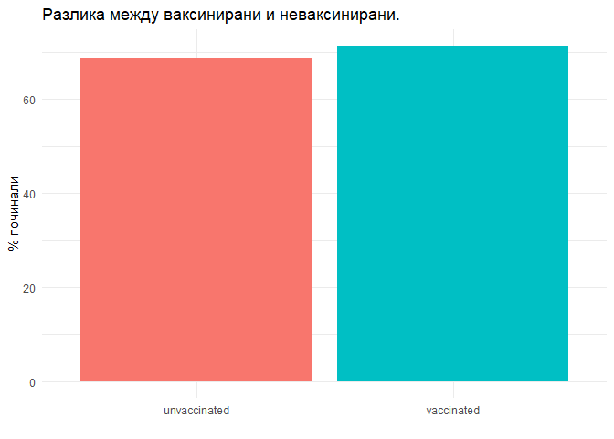
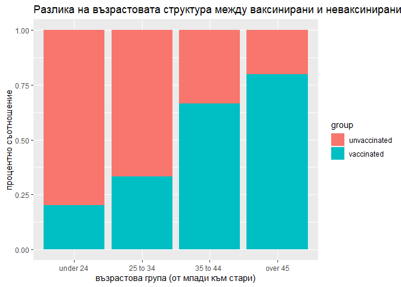
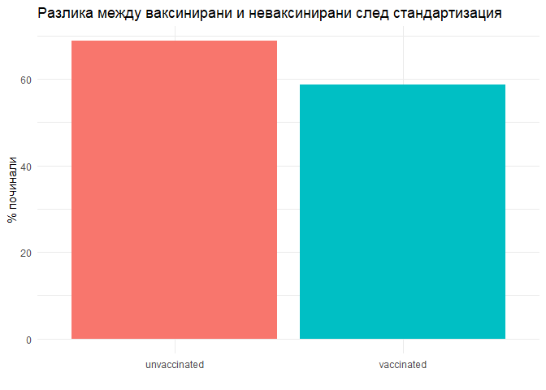

Упражнение 1
================
ас.д-р К. Костадинов
21.09.2021 г

# Вместо увод

## Защо учим статистика?

-   Статистиката е метод който използваме за да превърнем данните в
    информация.
-   Информацията, която получима се превръща в знание.
-   Знанието се въвежда в ежедневната медицинска практика, чрез клинични
    наръчници или политики в общественото здравеопазване.
-   По пътя на тази логическа верига, дори и малко нескромно,
    статистиката е метод, който пряко помага, както на пациента, като и
    на здравето на обществото.

## С какво ще ни помогне статистиката?

-   Да взимаме информирани решения в ежедневната ни практика.
-   Да взимаме най-добрите решения базирани на доказателства за политики
    в общественото здравеопазване.
-   Да разберем как работи науката.
-   За да четем критично нова научна информация.
-   За да сме по добри лекари.

## Какво няма да научим?

Понастоящем статистиката е силен инструмент в т.н “наука за данните”
(data science). В съчетание със сложна математика, програмиране и доза
креативност тази нова дисциплина решава редица практически задачи чрез
използване на компютърни технологии. В момента дори има разработени
скенери които “сами разчитат” дали има заболяване и с изчислена възможна
“грешка” класифицират какво е то. Това е възможно именно заради
инструментите, които статистиката ни предоставя. Разработени са и
електрокардиографи записващи сърдечната дейност на пациента и
“автоматично” разпознаващи дали е налице определено заболяване. В този
курс, обаче целта е да придобиете най-основите знания за това как работи
статистиката, каква е логиката в нея и какъв език използва.

# Упражнение 1

Преди да започнем със задачата за това упражнение, следва да се
запознаем с някои основни понятия в статистиката:

## Терминология

В статистиката един от най-сложните елементи за студента са `термините`.
За да “не сме изгубени в превода” в упражненията, ще въвеждаме тези
термини с някои основни примери. Опитайте се след всяко упражнения и
лекция да преговорите тези термини. Съшо така се опитайте да си дадете
собствен пример за някой от тях, ако не успявате, следва да изясните
този термин възможно най-скоро. Много вероятно е някой от тези думички
да бъде използвана отново за да се обяснят по-сложни концепции в
следващите ни занятия. `Вероятно` произхожда от `вероятност` и това е
много важен термин който ще изясним в следващите ни упражнения.

-   `абсолютни величини`

Това са абсолютни **числа**, които количествено характеризират обемите
на статистическите съвкупности или на части от тях, както и значенията
на статистическите признаци.

Те са винаги **наименовани числа**, измерени в съответните **мерни
единици** . Статистическите изследвания обикновено започват с анализ на
абсолютни величини, но този тип величини **не са достатъчни** за
директни сравнения в **пространствено-времеви аспект.**

За да звучи достъпно, нека използваме *пример*. Систолното артериално
налягане измерено в mmHg е абсолютна величина- има абсолютна стойност,
мерна единица и количествено характеризира систолното артериалното
налягане. Кръвната захар измерена в mmol/l също е абсолютна величина -
отново е число отразяващо количествено определен признак.

-   `относителни величини`

Те се изчисляват се като частно от делението на две абсолютни величини.
Представят като коефициенти, в проценти (когато коефициентът се умножи
по 100), в промили (когато коефициентът се умножи по 1000) и т.н.

В медицината често използваме относителни величини, *например* когато
измерваме помената функция на сърцето можем да използваме за показател
колко милилитра кръв постъпват в аортата след една систола (ударен
обем). Това е абсолютна величина - има мерна единица (ml) и
характеризира сърдечната дейност. Логично е хората с по-висок ръст и
тегло (по-едро телосложение) ще имат по-високи стойности за този
показател отколкото хората с по-нисък ръст и по-малко тегло. Също е
логично сърцето на състезател по сумо да изпомпва по-голямо количество
кръв (в милилитри) спрямо сърцето на първокласник. Означава ли това, че
сърцето на състезателя по сумо работи по-добре от това на първокласника?
Отговорът е, че не можем да преценим - двете абсолютни величини не са
достатъчни за сравнение. Затова по-важното в случая е какво е
съотношението на ударният обем, спрямо количеството кръв налично в
сърцето в края на диастолата. Това е т.н “фракция на изтласкване” и
представлява `относителна величина`. Понеже е отношение на две числа,
когато умножим това отношение х 100 получаваме “%”.

-   `екстензивни показатели`

Наричат се още **структурни** и показват как явлението се разпределя на
съставните му части, когато то се разглежда самостоятелно само за себе
си в определено време и място. *Например* ако приемем “възрастта” в гр.
Пловдив за “явление” можем да представим всички жители на град Пловдив в
категории според възрастовата им група: новородени до 1г., между 1 и 5
год., от 5 до 10г. и т.н. Ако изчислим броя на хората в съответната
възрастовата група спрямо всички жители на града ще получим
`екстензивен показател` .

<!-- -->

Както се вижда от фигурата, най-голяма е пропорцията на жителите във
възрастта от 40 до 44 год. Тази пропорция е част от всички жители на
град на Пловдив. Това същността на екстензивния показател- едно явление,
в случая възрастта в конкретно място (гр. Пловдив) в конкретна година
(2020) разложено на съставните му части (възрастовите периоди пред 5
годишен интервал)

-   `интензивни показатели`

Te се наричат се още **честотни** и показват колко често се среща дадено
явление в свойствената му среда. Всяка относителна величина е отношение
между обемите на две различни статистически съвкупности, но намиращи се
във връзка помежду си. В числителя е явлението, а в знаменателя е
абсолютният обем на средата, в която възниква определеното събитие.

За да разберем какво е интензивен показател ще дадем един негов
представител, често използван в медицината (още по-често неизползван,
когато трябва да бъде използван). Това е показателя *леталитет*.

`Леталитет` е показател представяш броя смъртни случаи от конкретно
заболяване върху броя на болните от това заболяване в за конкретен
период от време и място. *Например* леталитет при заболяването морбили
(дребна шарка) при деца (до 18г.) е 5%. Това означава, че теоретично, на
100 деца със заболяването (дребна шарка) 5 са с летален изход. Тези 5%
всъщност показват **честотата** на смъртни случаи при деца болни с
дребна шарка- тоест честотата на явлението в неговата свойствена среда.
В числителя на този показател постояваме броя смъртни случаи- това е
явлението, докато в знаменателя поставяме броя болни деца с морбили-
това е обема на средата в която се проявява явлението. На практика
числителят и знаменателя представляват две различни статистически
съвкупности, въпреки това те има връзка помежду си.

`Смъртността` е показател представяш броя на починалите спрямо средния
брой население в конкретната област и за конкретно време и не бива да се
бърка с `леталитет`.

В социалната медицина, епидемиологията и статистиката се ползват
множество такива показатели. **Например** `заболеваемост` , представлява
съотношението на броя новозаболели от някакво заболяване (например от
рак на гърдата) спрямо популацията в риск (всички, които биха могли да
се разболеят от това заболяване) за даден период от време. В 3-ти курс
ще се запознаете с още много подобни показатели, но е важно да знаете
тяхната идея. Използваме тези показатели за да оцененим определени
здравни явления, да ги измерим количествено (с някаква цифра), да можем
да ги сравняваме както в различни периоди, така и между различни държави
например.

В ежедневната практика като лекари също ще ползвате подобни `интензивни`
показатели. *Например* при пациенти с белодробна астма, вида на
използваното лечение зависи от честотата на екзацербации (обостряния)
т.н “exacerbation rate”. Това отново е `интензивен` показател.

## Пряк метод на стандартизация

Преди да прочетете определението за стандартизация, нека започнем с един
пример. Понеже това упражнение няма претенцията за академичен учебник,
нека си представим, че от днес ние сме състава на Министерство на
здравеопазването. Вие - министър , а аз ваш съветник със скромна
държавна залата. Изправени сме пред сериозен проблем: В държавата
върлува много опасен вирус (много по-опасен от COVID-19). Имаме ваксина,
но липса на доверие в нея. Много хора вярват, че ваксините дори убиват.
Днес след среща с граждани, противопоставящи се на ваксините, получавате
научна статия. Чрез нея, противниците на ваксините се опитват да ви
убедят, че ваксините са вредни. В нашият пример приемаме, че този нов
вирус може да засегне всички ни еднакво.

В `таблицата 1` можете да видите данните от тази научна публикация.

 
<table class="gt_table">
  <thead class="gt_header">
    <tr>
      <th colspan="3" class="gt_heading gt_title gt_font_normal" style>Табл.1. Опасни ваксини</th>
    </tr>
    <tr>
      <th colspan="3" class="gt_heading gt_subtitle gt_font_normal gt_bottom_border" style>неизветсен източник</th>
    </tr>
  </thead>
  <thead class="gt_col_headings">
    <tr>
      <th class="gt_col_heading gt_columns_bottom_border gt_left" rowspan="1" colspan="1">type</th>
      <th class="gt_col_heading gt_columns_bottom_border gt_right" rowspan="1" colspan="1">total</th>
      <th class="gt_col_heading gt_columns_bottom_border gt_right" rowspan="1" colspan="1">deaths</th>
    </tr>
  </thead>
  <tbody class="gt_table_body">
    <tr><td class="gt_row gt_left">vaccinated</td>
<td class="gt_row gt_right">4000</td>
<td class="gt_row gt_right">2850</td></tr>
    <tr><td class="gt_row gt_left">unvaccinated</td>
<td class="gt_row gt_right">8000</td>
<td class="gt_row gt_right">5500</td></tr>
  </tbody>
  
  
</table>

Таблицата е базирана на научно изследване във Великобритания. Авторът
посочва, че от 4000 ваксинирани са починали 2850 души, докато при
неваксинираните 8000 души са починали 5500. Тези числа всъщност
представляват `абсолютни величини`. За да се опитаме да ги сравним, ще
трябва да използваме `относителни величини`. Тоест каква пропорция от
ваксинираните са починали, същата пропорция от неваксинираните."
Сметката " тук е лесна : трябва да разделим броя на починалите
ваксинирани върху общият брой ваксинирани, както и броя на починалите
неваксинирани, спрямо общият брой неваксинирани. В резултат ще получим
`относителна величина` която също така ще представлява и
`интензивен показател`.

<!-- -->

Тук резултатът е изненада. Оказва се, че в групата на ваксинираните
71.2% са починали, докато при неваксинираните починали са 68.8%. Това е
разлика от 2,4 процентни пункта (важно простите аритметични операции
между проценти се изразяват в процентни пунктове). Може би наистина
“антиваксарите” имат право. Статията изглежда достоверна. Имаме толкова
много наблюдавани хора и изглежда, че сред ваксинираните имаме повече
починали.

Как бихме могли да си обясним този резултат? Нима наистина ваксините са
причина за по-големия брой смъртни случай? Трябва ли да продължим да
използваме тази ваксина, ако решението зависеше от нас? Бихме ли
посъветвали пациентите си да се ваксинират?

Преди да дадем категоричното си решение, можем малко да помислим върху
данните. Те все още не са информация на която да базираме решенията си.
В случая можем да разглеждаме цифрите в таблицата, като сурови данни
измерващи една връзка. Тази връзка е между ваксинацията и леталният
изход. Не изглежда логично смъртта да се причинява единствено от
ваксината или липсата на такава. Има редица други фактори, които влияят
на смъртта - придружаващи заболявания, предоставената медицинска помощ и
може би най-важният сред тях- ВЪЗРАСТТА. Нормално е, ако хората включени
в изследването са по-възрастни то да наблюдаваме и по-вече починали.

За да проверим дали възрастта “замъглява” връзката между ваксинацията и
смъртта можем да използваме статистическия метод на стандартизацията.

При сравняването на интензивни статистически показатели се наблюдава
фактът, че величината на тези показатели стои в зависимост от
структурата на средата, в която изучаваните явления се проявяват.
Например раждаемостта е по-висока в онези населени места, в които
преобладава население на възраст 20-30 г. При този и други случаи,
когато трябва да се сравняват интензивни статистически показатели,
изчислени от среда с различна структура, е необходимо да бъде приложен
т.нар. метод на стандартизация.

### Определение

-   Под `стандартизация` се разбира способът за преобразуване на общите
    коефициенти, позволяващ да се отстрани или елиминира влиянието на
    възрастовите или други различия в състава на сравняваните групи.
    `Стандартизираните` показатели позволяват да се анализира и оцени
    нивото на изучаваното явление при създадени `условия на еднородност`
    в сравняваните групи и показват какви биха били общите коефициенти в
    сравняваните групи, ако тези групи имаха `еднакъв състав.`

Отново поглеждайки нашият пример - възможно е да се окаже, че в групата
на ваксинираните са предпочетени повече възрастни хора, докато при
неваксинираните са повече младите. Това би обяснило тези резултати.
`Стандартизацията` е метод, които ще създаде възможност да сравним тези
две групи, след като премахнем действието на възрастта като “замъгляващ
фактор” в тази данни.

### Стъпки

За да извършим стандартизация (в курса по статистика се спираме
единствено и само на прекия метод за стандартизация) следва да
разполагаме с повече данни. Таблицата която разгледахме не съдържа
информация за възрастта на участниците. Затова след запитване към
авторът на публикацията получаваме по-подробни данни - които можете да
видите в таблица 2.

<table class="gt_table">
  <thead class="gt_header">
    <tr>
      <th colspan="3" class="gt_heading gt_title gt_font_normal gt_bottom_border" style>Табл.2. Ваксинирани и неваксинирани повъзрастови групи</th>
    </tr>
    
  </thead>
  <thead class="gt_col_headings">
    <tr>
      <th class="gt_col_heading gt_columns_bottom_border gt_center" rowspan="1" colspan="1">age_group</th>
      <th class="gt_col_heading gt_columns_bottom_border gt_right" rowspan="1" colspan="1">total_number</th>
      <th class="gt_col_heading gt_columns_bottom_border gt_right" rowspan="1" colspan="1">deaths</th>
    </tr>
  </thead>
  <tbody class="gt_table_body">
    <tr class="gt_group_heading_row">
      <td colspan="3" class="gt_group_heading">unvaccinated</td>
    </tr>
    <tr><td class="gt_row gt_center">under 24</td>
<td class="gt_row gt_right">4000</td>
<td class="gt_row gt_right">2400</td></tr>
    <tr><td class="gt_row gt_center">25 to 34</td>
<td class="gt_row gt_right">2000</td>
<td class="gt_row gt_right">1400</td></tr>
    <tr><td class="gt_row gt_center">35 to 44 </td>
<td class="gt_row gt_right">1000</td>
<td class="gt_row gt_right">800</td></tr>
    <tr><td class="gt_row gt_center">over 45</td>
<td class="gt_row gt_right">1000</td>
<td class="gt_row gt_right">900</td></tr>
    <tr class="gt_group_heading_row">
      <td colspan="3" class="gt_group_heading">vaccinated</td>
    </tr>
    <tr><td class="gt_row gt_center">under 24</td>
<td class="gt_row gt_right">500</td>
<td class="gt_row gt_right">250</td></tr>
    <tr><td class="gt_row gt_center">25 to 34</td>
<td class="gt_row gt_right">500</td>
<td class="gt_row gt_right">300</td></tr>
    <tr><td class="gt_row gt_center">35 to 44 </td>
<td class="gt_row gt_right">1000</td>
<td class="gt_row gt_right">700</td></tr>
    <tr><td class="gt_row gt_center">over 45</td>
<td class="gt_row gt_right">2000</td>
<td class="gt_row gt_right">1600</td></tr>
  </tbody>
  
  
</table>

Сега вече имаме повече данни не само за това колко са били ваксинирани и
колко не са, но и в каква възрастова група попадат. Може би, ви прави
впечатление, че ваксинираните са предимно по-възрастни хора, докато при
неваксинираните по-младите. Както можете да забележите от фигурата - във
групата до 24г. преобладат неваксинирани, докато при над 45-годинишните
ваксинираните. Можем да преминем към стъпка 1

<!-- -->

#### Стъпка 1 Изчисляваме нестандартизираните интензивни показатели

Както по-рано, така и сега, можем да изчислим какъв процент от
участниците в двете групи са починали. Това става като разделим броя на
починалите върху броя на участниците. В случая ще изчислим този
показател за всяка една възрастова група. След тези калкулации
получаваме:

<table class="gt_table">
  <thead class="gt_header">
    <tr>
      <th colspan="4" class="gt_heading gt_title gt_font_normal gt_bottom_border" style>Табл.3. Ваксинирани и неваксинирани повъзрастови групи</th>
    </tr>
    
  </thead>
  <thead class="gt_col_headings">
    <tr>
      <th class="gt_col_heading gt_columns_bottom_border gt_center" rowspan="1" colspan="1">age_group</th>
      <th class="gt_col_heading gt_columns_bottom_border gt_right" rowspan="1" colspan="1">total_number</th>
      <th class="gt_col_heading gt_columns_bottom_border gt_right" rowspan="1" colspan="1">deaths</th>
      <th class="gt_col_heading gt_columns_bottom_border gt_right" rowspan="1" colspan="1">fatality_rate_unstandardized</th>
    </tr>
  </thead>
  <tbody class="gt_table_body">
    <tr class="gt_group_heading_row">
      <td colspan="4" class="gt_group_heading">unvaccinated</td>
    </tr>
    <tr><td class="gt_row gt_center">under 24</td>
<td class="gt_row gt_right">4000</td>
<td class="gt_row gt_right">2400</td>
<td class="gt_row gt_right">60</td></tr>
    <tr><td class="gt_row gt_center">25 to 34</td>
<td class="gt_row gt_right">2000</td>
<td class="gt_row gt_right">1400</td>
<td class="gt_row gt_right">70</td></tr>
    <tr><td class="gt_row gt_center">35 to 44 </td>
<td class="gt_row gt_right">1000</td>
<td class="gt_row gt_right">800</td>
<td class="gt_row gt_right">80</td></tr>
    <tr><td class="gt_row gt_center">over 45</td>
<td class="gt_row gt_right">1000</td>
<td class="gt_row gt_right">900</td>
<td class="gt_row gt_right">90</td></tr>
    <tr class="gt_group_heading_row">
      <td colspan="4" class="gt_group_heading">vaccinated</td>
    </tr>
    <tr><td class="gt_row gt_center">under 24</td>
<td class="gt_row gt_right">500</td>
<td class="gt_row gt_right">250</td>
<td class="gt_row gt_right">50</td></tr>
    <tr><td class="gt_row gt_center">25 to 34</td>
<td class="gt_row gt_right">500</td>
<td class="gt_row gt_right">300</td>
<td class="gt_row gt_right">60</td></tr>
    <tr><td class="gt_row gt_center">35 to 44 </td>
<td class="gt_row gt_right">1000</td>
<td class="gt_row gt_right">700</td>
<td class="gt_row gt_right">70</td></tr>
    <tr><td class="gt_row gt_center">over 45</td>
<td class="gt_row gt_right">2000</td>
<td class="gt_row gt_right">1600</td>
<td class="gt_row gt_right">80</td></tr>
  </tbody>
  
  
</table>

В `таблица 3` колона `fatality_rate_unstandardized` представлява
нестандартизираният показател във всяка една от възрастовите групи за
ваксинираните и неваксинираните. Тук е важно да запомним, че общият
нестандартизиран показател не е сума от резултатите по подгрупи. Не
можем да сумираме тези показатели за ваксинирани и неваксинирани и да ги
сравним.

#### Стъпка 2 Изчисляване на “стандарта”

За да можем да сравним двете групи, трябва да “стандартизираме”
получените по групови показатели. Само след стандартизация е възможно да
сумиране получените числа по възрастови групи и да сравним ваксинирани
срещу неваксинирани. За да направим това е необходимо да изберем
възрастовата структура една от тези две групи за **стандарт**.

Тук, често възниква въпроса коя структура да изберем за стандарт? Защо
да предпочетем едната спрямо другата? Какво е правилото? Всъщност
отговорът на всички тези въпроси е че няма особено значение. Разбира се,
че числата след стандартизация ще са различни в зависимост коя структура
сме избрали за стандарт, но тук стойността на тези числа не е от толкова
голямо значение. От значение е коя от сумарните стойности е по-висока.
Независимо коя група сме избрали за стандарт, тази разлика остава една и
съща. Това е - независимо коя група изберем за “стандартна” то извода
няма да се промени. В това упражнение ще докажем това, като извършим
стандартизацията, като вземем за стандарт първо структурата на
неваксинираните, а после решим същият пример, като вземем за стандарт
структурата на ваксинираните.

Следващият въпрос, които вероятно възниква е “какво означава да вземем
за стандарт структурата на неваксинираните?”. Отговорът е логичен: ако
разгледаме само включените участници, които не са ваксинирани можем да
изчислим тяхната възрастова структура- ще използваме броя на участниците
в определена възрастова група за числител, а общия брой неваксинирани за
знаменател. Така сред като изчислим какъв процент участници имаме във
всяка възрастова група ще получим `екстензивен коефициент` който ще
ползваме за да стандартизираме `интензивните показатели` за всяка една
от възрастовите групи.

Това сме направили в `таблица 4`. Първо сме изчислили “стандарта” за
участниците под 24г. - те са 4000, спрямо общият брой неваксинирани
8000. Получаваме 0.5 (ако умножим по 100 ще получим %, т.е. участниците
до 24 години) са половината от всички участници. Това ще използваме за
стандарт както за ваксинираните така и за неваксинираните. По подобен
начин сме получили и стандарта за възрастовата група от 25 до 34г. В
групата на неваксинираните те са 2000, което представлява 25% (или 0.25)
от всички неваксинирани. Тази стойност 0.25 ще използваме за стандарт за
всички участници от 25 до 34г. - ваксинирани и неваксинирани. Това е
логиката при всеки един от тези коефициенти в таблица 4. Може да ви
направи впечатление, че сбора на всички стандарти е равен на 1-ца (тоест
100%). Това е така защото този стандарт всъщност е `екстензивен`
показател - показва как се разлага явлението “възраст” на съставните и
части- отделните възрастови групи.

<table class="gt_table">
  <thead class="gt_header">
    <tr>
      <th colspan="5" class="gt_heading gt_title gt_font_normal gt_bottom_border" style>Таблица 4. Изчисляване на стандарта спрямо групата на неваксинираните</th>
    </tr>
    
  </thead>
  <thead class="gt_col_headings">
    <tr>
      <th class="gt_col_heading gt_columns_bottom_border gt_center" rowspan="1" colspan="1">age_group</th>
      <th class="gt_col_heading gt_columns_bottom_border gt_right" rowspan="1" colspan="1">total_number</th>
      <th class="gt_col_heading gt_columns_bottom_border gt_right" rowspan="1" colspan="1">deaths</th>
      <th class="gt_col_heading gt_columns_bottom_border gt_right" rowspan="1" colspan="1">fatality_rate_unstandardized</th>
      <th class="gt_col_heading gt_columns_bottom_border gt_right" rowspan="1" colspan="1">standard_unvaccinated</th>
    </tr>
  </thead>
  <tbody class="gt_table_body">
    <tr><td class="gt_row gt_center">under 24</td>
<td class="gt_row gt_right">4000</td>
<td class="gt_row gt_right">2400</td>
<td class="gt_row gt_right">60</td>
<td class="gt_row gt_right">0.500</td></tr>
    <tr><td class="gt_row gt_center">25 to 34</td>
<td class="gt_row gt_right">2000</td>
<td class="gt_row gt_right">1400</td>
<td class="gt_row gt_right">70</td>
<td class="gt_row gt_right">0.250</td></tr>
    <tr><td class="gt_row gt_center">35 to 44 </td>
<td class="gt_row gt_right">1000</td>
<td class="gt_row gt_right">800</td>
<td class="gt_row gt_right">80</td>
<td class="gt_row gt_right">0.125</td></tr>
    <tr><td class="gt_row gt_center">over 45</td>
<td class="gt_row gt_right">1000</td>
<td class="gt_row gt_right">900</td>
<td class="gt_row gt_right">90</td>
<td class="gt_row gt_right">0.125</td></tr>
  </tbody>
  
  
</table>

#### Стъпка 3: Изчисляване на стандартизираните показатели за заболеваемост

След като имаме “стандарт”, можем да пристъпим към следващата стъпка.
Смъртността която изчислихме в таблица 3, беше нестандартизирана. Сега е
момента да използваме “стандарта” от стъпка 2 и да я стандартизираме.
Как става това? Решението е лесно: за всяка една от възрастовите групи
умножаваме нестандартизирания показател по стандарта.

<table class="gt_table">
  <thead class="gt_header">
    <tr>
      <th colspan="6" class="gt_heading gt_title gt_font_normal gt_bottom_border" style>Таблица 5. Изчисляване на стандартизираните показатели</th>
    </tr>
    
  </thead>
  <thead class="gt_col_headings">
    <tr>
      <th class="gt_col_heading gt_columns_bottom_border gt_center" rowspan="1" colspan="1">age_group</th>
      <th class="gt_col_heading gt_columns_bottom_border gt_right" rowspan="1" colspan="1">total_number</th>
      <th class="gt_col_heading gt_columns_bottom_border gt_right" rowspan="1" colspan="1">deaths</th>
      <th class="gt_col_heading gt_columns_bottom_border gt_right" rowspan="1" colspan="1">fatality_rate_unstandardized</th>
      <th class="gt_col_heading gt_columns_bottom_border gt_right" rowspan="1" colspan="1">standard_unvaccinated</th>
      <th class="gt_col_heading gt_columns_bottom_border gt_right" rowspan="1" colspan="1">fatality_rate_standardized</th>
    </tr>
  </thead>
  <tbody class="gt_table_body">
    <tr class="gt_group_heading_row">
      <td colspan="6" class="gt_group_heading">unvaccinated</td>
    </tr>
    <tr><td class="gt_row gt_center">under 24</td>
<td class="gt_row gt_right">4000</td>
<td class="gt_row gt_right">2400</td>
<td class="gt_row gt_right">60</td>
<td class="gt_row gt_right">0.500</td>
<td class="gt_row gt_right">30.00</td></tr>
    <tr><td class="gt_row gt_center">25 to 34</td>
<td class="gt_row gt_right">2000</td>
<td class="gt_row gt_right">1400</td>
<td class="gt_row gt_right">70</td>
<td class="gt_row gt_right">0.250</td>
<td class="gt_row gt_right">17.50</td></tr>
    <tr><td class="gt_row gt_center">35 to 44 </td>
<td class="gt_row gt_right">1000</td>
<td class="gt_row gt_right">800</td>
<td class="gt_row gt_right">80</td>
<td class="gt_row gt_right">0.125</td>
<td class="gt_row gt_right">10.00</td></tr>
    <tr><td class="gt_row gt_center">over 45</td>
<td class="gt_row gt_right">1000</td>
<td class="gt_row gt_right">900</td>
<td class="gt_row gt_right">90</td>
<td class="gt_row gt_right">0.125</td>
<td class="gt_row gt_right">11.25</td></tr>
    <tr class="gt_group_heading_row">
      <td colspan="6" class="gt_group_heading">vaccinated</td>
    </tr>
    <tr><td class="gt_row gt_center">under 24</td>
<td class="gt_row gt_right">500</td>
<td class="gt_row gt_right">250</td>
<td class="gt_row gt_right">50</td>
<td class="gt_row gt_right">0.500</td>
<td class="gt_row gt_right">25.00</td></tr>
    <tr><td class="gt_row gt_center">25 to 34</td>
<td class="gt_row gt_right">500</td>
<td class="gt_row gt_right">300</td>
<td class="gt_row gt_right">60</td>
<td class="gt_row gt_right">0.250</td>
<td class="gt_row gt_right">15.00</td></tr>
    <tr><td class="gt_row gt_center">35 to 44 </td>
<td class="gt_row gt_right">1000</td>
<td class="gt_row gt_right">700</td>
<td class="gt_row gt_right">70</td>
<td class="gt_row gt_right">0.125</td>
<td class="gt_row gt_right">8.75</td></tr>
    <tr><td class="gt_row gt_center">over 45</td>
<td class="gt_row gt_right">2000</td>
<td class="gt_row gt_right">1600</td>
<td class="gt_row gt_right">80</td>
<td class="gt_row gt_right">0.125</td>
<td class="gt_row gt_right">10.00</td></tr>
  </tbody>
  
  
</table>

Сега сме почти готови- имаме стандартизираните показатели като сме
умножили интензивните показатели за смъртност
`fatality_rate_unstandardized` по квотата за стандарт
`standard_unvaccinated`. Тази квота всъщност беше възрастовата структура
на групата неваксинирани (нея избрахме за стандарт). Вече знаете, че
нестандартизираните показатели не се събират (това го питат на изпит
чувам). За сметка на това стандартизираните могат да бъдат събирани-
защото иначе цялата тази математическа главоблъсканица би била излишна.
Когато съберем стандартизираните показатели по възрастови групи ще
получим стандартизирания интензивен показател за смъртността - както за
ваксинирани така и за неваксинирани. Този показател е стандартизиран за
възрастта. Тоест, сме избегнали “замъгляващият ефект” на това, че са
ваксинирани предимно възрастни хора, а неваксинирани са преидмно млади.

Нека извършим тази последна калкулация. За групата на ваксинираните това
означава да съберем `25%` (смъртността в тази група при ваксинирани) +
`15%` (във възрастовата група 25-34г.) + `8.75 %`(35-44г.) + `10%` (за
тези над 45г.). Получаваме `58.75%`. Тук следва да направим същото и за
групата на неваксинираните. За тях сборът е `65.75%.` фиг. 6 ги показва
по-систематично.

<table class="gt_table">
  <thead class="gt_header">
    <tr>
      <th colspan="2" class="gt_heading gt_title gt_font_normal gt_bottom_border" style>Таблица 6. Сравнение на стандартизираните показатели</th>
    </tr>
    
  </thead>
  <thead class="gt_col_headings">
    <tr>
      <th class="gt_col_heading gt_columns_bottom_border gt_center" rowspan="1" colspan="1">group</th>
      <th class="gt_col_heading gt_columns_bottom_border gt_right" rowspan="1" colspan="1">total_fatality_rate_standardized</th>
    </tr>
  </thead>
  <tbody class="gt_table_body">
    <tr><td class="gt_row gt_center">unvaccinated</td>
<td class="gt_row gt_right">68.75</td></tr>
    <tr><td class="gt_row gt_center">vaccinated</td>
<td class="gt_row gt_right">58.75</td></tr>
  </tbody>
  
  
</table>

#### Стъпка 4: Заключение

Стандартизираните показатели за заболеваемост в двете групи са съответно
`58.75%` и `68.75%`. Заболеваемостта сред неваксинираните, е с 10%
по-висока. (Обърнете внимание тук разликата между проценти остава също
процент, а не процентен пункт. Причината за това е защото тези
показатели са стандартизирани- тоест сме “изравнили” тяхната структура,
в случая възрастова структура.)

<!-- -->

Предполагам, обаче някои от вас се питат, какво би се случило, ако не
ползваме за стандарт възрастовата структура на неваскинираните. Защо
избрахме точно нея? Това не е ли пристрастие?

За да докажем, че за изводът няма значение коя структура използваме, ще
решим отново примера, като този път за стандарт, използваме структурата
на ваксинираните. Отново от стъпка 2.

#### Стъпка 2 Изчисляваме стандарта (този път спрямо ваксинираните)

В този случай за да изчислим стандарта започваме, като гледаме таблицата
само за ваксинираните. В нея установяваме, че участниците под 24г. са
500 от общо 4000. Това означава, че стандарта е 0.125 (или 12.5%). Това
извършваме за всяка една от възрастовите групи. Резултатът е видим в
таблица 7.

<table class="gt_table">
  <thead class="gt_header">
    <tr>
      <th colspan="5" class="gt_heading gt_title gt_font_normal gt_bottom_border" style>Таблица 7. Изчисляване на стандарта спрямо групата на ваксинираните</th>
    </tr>
    
  </thead>
  <thead class="gt_col_headings">
    <tr>
      <th class="gt_col_heading gt_columns_bottom_border gt_center" rowspan="1" colspan="1">age_group</th>
      <th class="gt_col_heading gt_columns_bottom_border gt_right" rowspan="1" colspan="1">total_number</th>
      <th class="gt_col_heading gt_columns_bottom_border gt_right" rowspan="1" colspan="1">deaths</th>
      <th class="gt_col_heading gt_columns_bottom_border gt_right" rowspan="1" colspan="1">fatality_rate_standardized</th>
      <th class="gt_col_heading gt_columns_bottom_border gt_right" rowspan="1" colspan="1">standard_unvaccinated</th>
    </tr>
  </thead>
  <tbody class="gt_table_body">
    <tr><td class="gt_row gt_center">under 24</td>
<td class="gt_row gt_right">500</td>
<td class="gt_row gt_right">250</td>
<td class="gt_row gt_right">50</td>
<td class="gt_row gt_right">0.125</td></tr>
    <tr><td class="gt_row gt_center">25 to 34</td>
<td class="gt_row gt_right">500</td>
<td class="gt_row gt_right">300</td>
<td class="gt_row gt_right">60</td>
<td class="gt_row gt_right">0.125</td></tr>
    <tr><td class="gt_row gt_center">35 to 44 </td>
<td class="gt_row gt_right">1000</td>
<td class="gt_row gt_right">700</td>
<td class="gt_row gt_right">70</td>
<td class="gt_row gt_right">0.250</td></tr>
    <tr><td class="gt_row gt_center">over 45</td>
<td class="gt_row gt_right">2000</td>
<td class="gt_row gt_right">1600</td>
<td class="gt_row gt_right">80</td>
<td class="gt_row gt_right">0.500</td></tr>
  </tbody>
  
  
</table>

#### Повтаряме Стъпка 3: Изчисляване на стандартизираните показатели за заболеваемост

След като имаме “стандарт”, този път спрямо групата на ваксинираните
можем да пристъпим отново към стъпка 3. Сега е момента да използваме
“стандарта” от новата стъпка 2. Решението отново е лесно: за всяка една
от възрастовите групи умножаваме нестандартизирания показател по
стандарта.

<table class="gt_table">
  <thead class="gt_header">
    <tr>
      <th colspan="6" class="gt_heading gt_title gt_font_normal gt_bottom_border" style>Таблица 8. Изчисляване на стандартизираните показатели</th>
    </tr>
    
  </thead>
  <thead class="gt_col_headings">
    <tr>
      <th class="gt_col_heading gt_columns_bottom_border gt_center" rowspan="1" colspan="1">age_group</th>
      <th class="gt_col_heading gt_columns_bottom_border gt_right" rowspan="1" colspan="1">total_number</th>
      <th class="gt_col_heading gt_columns_bottom_border gt_right" rowspan="1" colspan="1">deaths</th>
      <th class="gt_col_heading gt_columns_bottom_border gt_right" rowspan="1" colspan="1">fatality_rate_unstandardized</th>
      <th class="gt_col_heading gt_columns_bottom_border gt_right" rowspan="1" colspan="1">standard_vaccinated</th>
      <th class="gt_col_heading gt_columns_bottom_border gt_right" rowspan="1" colspan="1">fatality_rate_standardized</th>
    </tr>
  </thead>
  <tbody class="gt_table_body">
    <tr class="gt_group_heading_row">
      <td colspan="6" class="gt_group_heading">unvaccinated</td>
    </tr>
    <tr><td class="gt_row gt_center">under 24</td>
<td class="gt_row gt_right">4000</td>
<td class="gt_row gt_right">2400</td>
<td class="gt_row gt_right">60</td>
<td class="gt_row gt_right">0.125</td>
<td class="gt_row gt_right">7.50</td></tr>
    <tr><td class="gt_row gt_center">25 to 34</td>
<td class="gt_row gt_right">2000</td>
<td class="gt_row gt_right">1400</td>
<td class="gt_row gt_right">70</td>
<td class="gt_row gt_right">0.125</td>
<td class="gt_row gt_right">8.75</td></tr>
    <tr><td class="gt_row gt_center">35 to 44 </td>
<td class="gt_row gt_right">1000</td>
<td class="gt_row gt_right">800</td>
<td class="gt_row gt_right">80</td>
<td class="gt_row gt_right">0.250</td>
<td class="gt_row gt_right">20.00</td></tr>
    <tr><td class="gt_row gt_center">over 45</td>
<td class="gt_row gt_right">1000</td>
<td class="gt_row gt_right">900</td>
<td class="gt_row gt_right">90</td>
<td class="gt_row gt_right">0.500</td>
<td class="gt_row gt_right">45.00</td></tr>
    <tr class="gt_group_heading_row">
      <td colspan="6" class="gt_group_heading">vaccinated</td>
    </tr>
    <tr><td class="gt_row gt_center">under 24</td>
<td class="gt_row gt_right">500</td>
<td class="gt_row gt_right">250</td>
<td class="gt_row gt_right">50</td>
<td class="gt_row gt_right">0.125</td>
<td class="gt_row gt_right">6.25</td></tr>
    <tr><td class="gt_row gt_center">25 to 34</td>
<td class="gt_row gt_right">500</td>
<td class="gt_row gt_right">300</td>
<td class="gt_row gt_right">60</td>
<td class="gt_row gt_right">0.125</td>
<td class="gt_row gt_right">7.50</td></tr>
    <tr><td class="gt_row gt_center">35 to 44 </td>
<td class="gt_row gt_right">1000</td>
<td class="gt_row gt_right">700</td>
<td class="gt_row gt_right">70</td>
<td class="gt_row gt_right">0.250</td>
<td class="gt_row gt_right">17.50</td></tr>
    <tr><td class="gt_row gt_center">over 45</td>
<td class="gt_row gt_right">2000</td>
<td class="gt_row gt_right">1600</td>
<td class="gt_row gt_right">80</td>
<td class="gt_row gt_right">0.500</td>
<td class="gt_row gt_right">40.00</td></tr>
  </tbody>
  
  
</table>

Логично, след като сме използвали и друг стандарт, изчислените
стандартизирани показатели са различни. Отново напомням, не се
интересуваме от конкретното число, а от заключението което ще направим.
Отново можем да сумираме стандартизираните показатели.

<table class="gt_table">
  <thead class="gt_header">
    <tr>
      <th colspan="2" class="gt_heading gt_title gt_font_normal gt_bottom_border" style>Таблица 9. Изчисляване на стандартизираните показатели</th>
    </tr>
    
  </thead>
  <thead class="gt_col_headings">
    <tr>
      <th class="gt_col_heading gt_columns_bottom_border gt_center" rowspan="1" colspan="1">group</th>
      <th class="gt_col_heading gt_columns_bottom_border gt_right" rowspan="1" colspan="1">total_fatality_rate_standardized</th>
    </tr>
  </thead>
  <tbody class="gt_table_body">
    <tr><td class="gt_row gt_center">unvaccinated</td>
<td class="gt_row gt_right">81.25</td></tr>
    <tr><td class="gt_row gt_center">vaccinated</td>
<td class="gt_row gt_right">71.25</td></tr>
  </tbody>
  
  
</table>

Отново стандартизираните показател в групата на ваксинираните с 10%
по-нисък от този на неваксинираните.
